# 动漫提示词库 · Anime Prompt Library

面向 **Midjourney / Stable Diffusion / SDXL / Illustrious / Flux / NovelAI** 的动漫风格系统化词库，共 **412 条**，单一数据源同时产出**可检索网页**与 **Markdown 源文件**。

> 本文所有数字（412 条 · 537 节点 · 画廊 13 张等）都是**提交时的实况快照**：
> 口径由 `tools/inventory.js` 与 `codex-skill … gallery --todo` 现算，条目增删后会变，引用前先跑命令核对。

**五层内容**（画风流派 59 · 作品 IP 233 · 题材元素 32 · 排版图型 30 · 主题配色 12）**每一条都配了提示词卡**，其中 GPT 正文 **324/324 全覆盖**，整段复制即可出图。

覆盖范围：**日本 · 中国 · 韩国 · 印度东南亚 · 法国比利时 · 英国爱尔兰 · 北欧 · 苏联东欧 · 德国西班牙 · 拉美 · 北美**，兼顾主流作品与各地的**动画史风格流派**。

**在线使用（无需克隆仓库）**：**https://gaoren7716-lab.github.io/anime-prompt-library/**

打开就是三个入口，不需要先理解检索、组合、编码这些内部概念：

| 我想… | 入口 | 你会得到 |
| --- | --- | --- |
| 先看效果 | **示例画廊** | 真图与提示词对照，点开复制整段 GPT 正文 |
| 从零创作 | **出图工作流** | 画风 → 题材 → 版式 → 配色四步选型，**五个模型各出一份按其语法优化的提示词** |
| 还没想好 | **一键抽卡** | 随机抽一组组合，可直接出图 |

<!-- GALLERY-EMBED:START -->
## 示例画廊 · 提示词与成品对照

共 **49 条**，全部为 R0 条目（本库授权分级中的最低档：未命中在世创作者姓名、工作室名、品牌或作品名，按 `assets/rights.js` 的内部规则判定可自由配图。这是内部分级判定，不构成法律意见——商用前请自行复核）。其中 **46 张已配图**，每张由该条目的 **GPT 正文**直接生成——复制折叠区里的提示词，喂给任意出图模型就能得到同风格的结果；另有 3 条**提示词已就绪、待配图**（见下方清单）。可交互的完整画廊在 `index.html`。

<table>
<tr>
<td valign="top" width="50%">

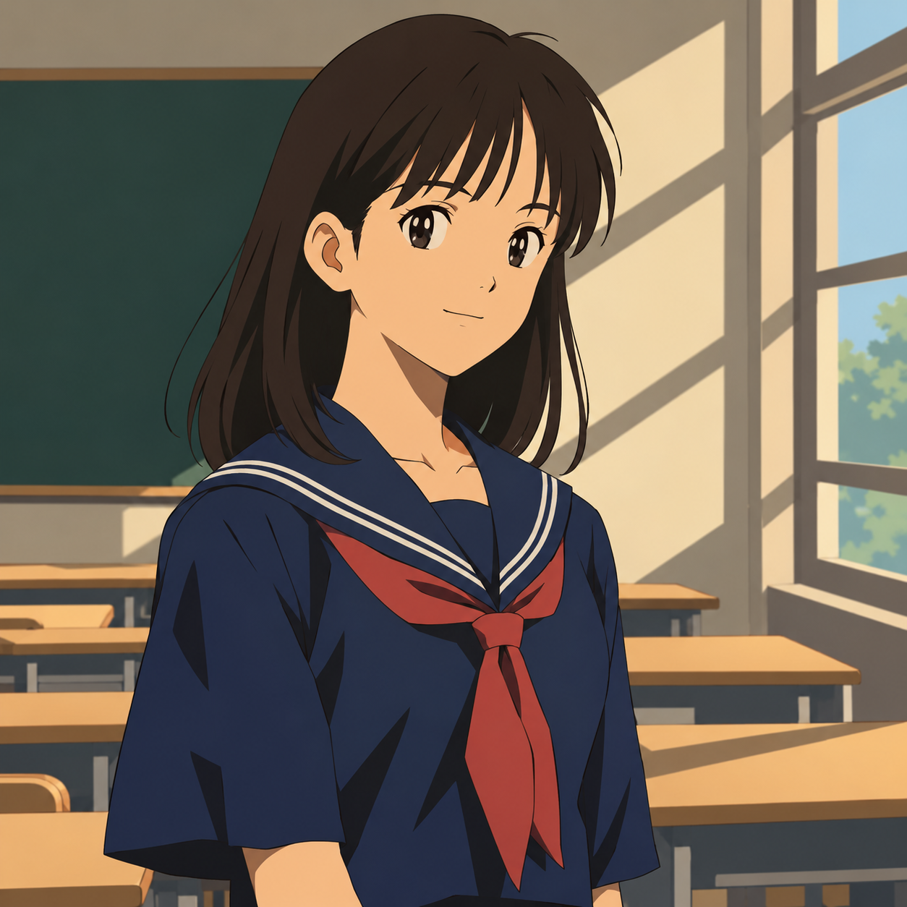

**A1-01 · 赛璐璐平涂**（Cel Shading）

看点：看点：暗部只有一层、边界锐利无渐变，背景压成纯色块——hard shadow 与 flat color 的教科书验证。

<details><summary>📋 完整提示词（GPT 正文，复制即用）</summary>

```text
Classic Japanese cel-shaded anime illustration: a teenage girl in a navy sailor uniform standing in an empty classroom filled with afternoon sunlight. Shade her strictly with the traditional two-tone cel method, one flat base tone for every lit surface succeeded by a single crisp second shadow whose boundary stays razor sharp with no gradient anywhere between them. Surround every form with even-weight dark brown lineart and reduce background desks and window frames to large flat unmodulated color blocks. Restrict the scheme to warm skin, deep navy uniform cloth, muted chalkboard green and pale sunlit wood. Compose a waist-up portrait under flat even lighting free of rim light, bloom or photographic artifacts. Keep the frame clean with no text, logos, watermarks or UI elements.
```

</details>

</td>
<td valign="top" width="50%">

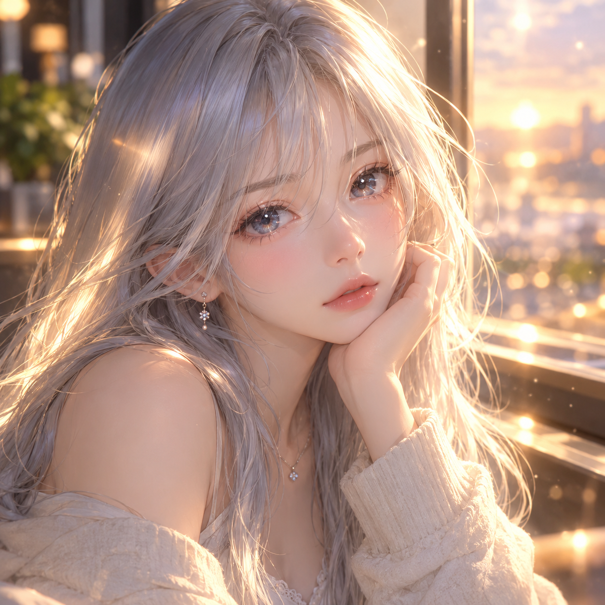

**A1-02 · 现代数码柔光**（Modern Digital Soft Shading）

看点：看点：光从窗口斜射进来，亮部过渡是连续渐变而不是分层色块，阴影里仍有通透感——这正是「数码柔光」与赛璐璐平涂的分界。右下角有通道水印，商用须裁掉。

<details><summary>📋 完整提示词（GPT 正文，复制即用）</summary>

```text
Contemporary digital anime illustration finished with soft airbrush shading: a young woman with long silver hair and glossy eyes seated by a window at golden hour. Build the rendering from many layered gradients instead of hard cel boundaries, blending every transition until it disappears, and layer broad blurred highlight rings through the hair along with a translucent glow across the cheekbones. Give the irises several overlapping highlight discs and a soft bounce light along the lower lid. Soften the background into natural bokeh with slow drifting dust particles for commercial polish. Compose a chest-up portrait lit warmly and gently. Include no text, logos, watermarks or signature anywhere in the image.
```

</details>

</td>
</tr>
<tr>
<td valign="top" width="50%">

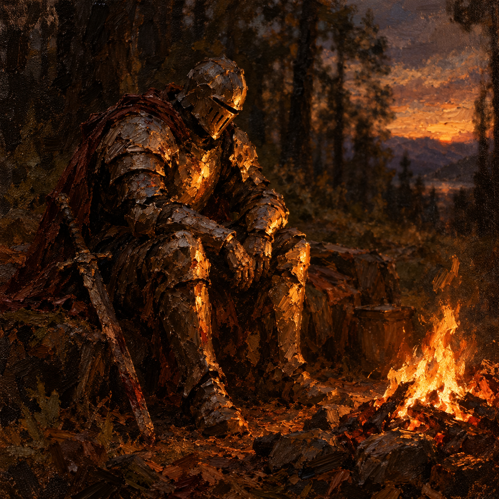

**A1-03 · 厚涂 / 油绘感**（Thick Paint / Painterly）

看点：看点：笔触有物理厚度、刀刮的脊线在火光下起边，暗部是暖棕底层而非纯黑——厚涂与 CG 渲染的分界就在这里。

<details><summary>📋 完整提示词（GPT 正文，复制即用）</summary>

```text
Painterly anime illustration executed in thick impasto oil technique: a battered knight seated beside a dying campfire at dusk. Apply pigment in visible directional strokes rather than smooth fills so that ridges of paint physically catch the firelight along armor bevels, and construct every shadow from dense warm brown underlayers. Maintain an old-master value structure with deep integrated shadow masses and one dominant warm key light blooming off the front plate. Let edges stay broken and searching rather than slick, with coarse canvas tooth faintly visible through the dark background. Compose a three-quarter view with focus falling off sharply into the trees behind. Include no text, logos or watermarks.
```

</details>

</td>
<td valign="top" width="50%">

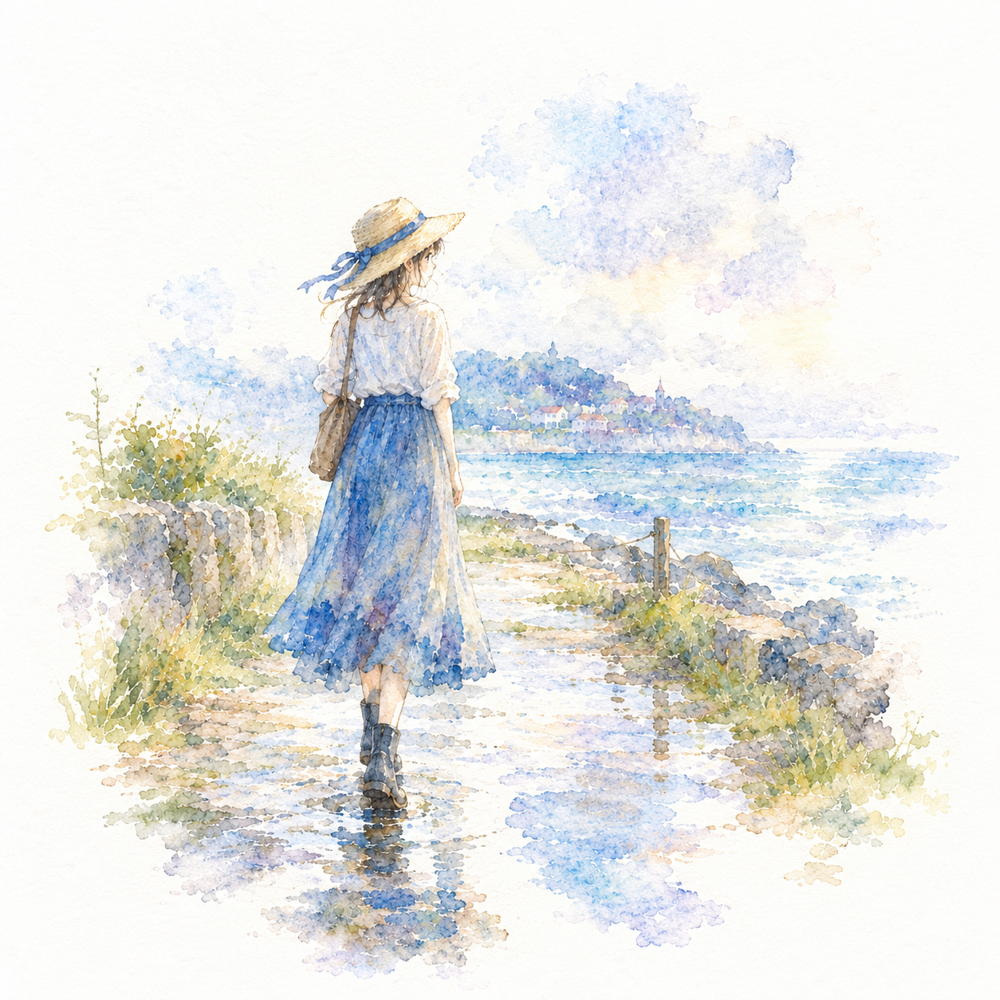

**A1-04 · 透明水彩**（Transparent Watercolor）

看点：看点：最亮处就是纸本身的白，颜色在湿纸上自然洇开、边缘留水痕——透明水彩区别于不透明水粉的核心证据。

<details><summary>📋 完整提示词（GPT 正文，复制即用）</summary>

```text
Transparent watercolor anime illustration: a girl in a straw hat walking along a puddled seaside path just after rain. Use nothing but transparent washes, allowing the white of the paper itself to serve as the brightest highlight and building every tone by layering diluted pigment so colors mix optically on the sheet instead of being premixed on a palette. Let wet-on-wet blooms soften the horizon line and pool unevenly at the hem of the skirt while granulation settles quietly into the shadows. Keep a light graphite under-drawing visible beneath the wash. Leave generous untouched paper around the figure and add no border or frame. No text, logos or watermarks.
```

</details>

</td>
</tr>
<tr>
<td valign="top" width="50%">

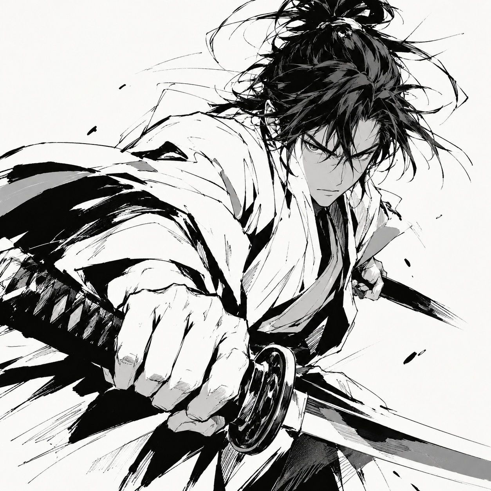

**A1-05 · 粗描线稿 / 线稿至上**（Bold Lineart Focus）

看点：看点：纯黑白、近处线条粗黑厚重而远处迅速收细，几乎不用灰调——线重变化是手绘感的第一来源。

<details><summary>📋 完整提示词（GPT 正文，复制即用）</summary>

```text
Bold lineart-driven anime illustration with almost no applied color: a swordsman caught mid-draw in one explosive moment. Make the drawing itself the subject by varying line weight decisively, loading heavy black strokes onto the forms closest to the viewer and thinning them as shapes recede, and leaving deliberate open gaps and slight overshoot where a hand would naturally break the contour. Add rough searching pencil strokes in a few places and one passing of light hatching in the deepest shadows only, plus a single flat gray tone as spot accent. Stage it diagonally against a nearly empty background. Include no text, speech bubbles, logos or watermarks.
```

</details>

</td>
<td valign="top" width="50%">


**A1-07 · Q 版 / 二头身**（Chibi / Super Deformed）

看点：看点：二头身、贴纸式白边、大面积粉彩——Q 版的比例逻辑与正常头身完全不同。

<details><summary>📋 完整提示词（GPT 正文，复制即用）</summary>

```text
Chibi super-deformed anime character design: a cheerful cat-eared girl holding an ice cream cone taller than her own body. Compress the proportions to roughly two head-lengths in total with an enormous rounded head, small stubby limbs and simplified mitten hands, keeping the eyes huge, sparkling and set low on the face beside a small bright mouth. Render everything with simple clean shapes, minimal shading and bright saturated toy-like colors so the silhouette reads instantly even at icon size. Center her against a plain pastel circle on open ground with no additional props. Include no background clutter, no text, logos, watermarks or UI frames.
```

</details>

</td>
</tr>
<tr>
<td valign="top" width="50%">

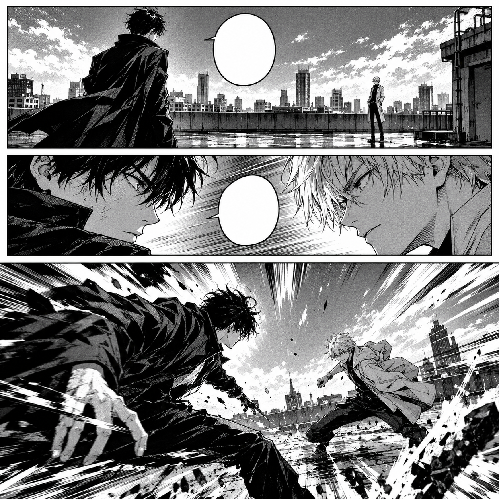

**A1-08 · 黑白漫画页**（Monochrome Manga）

看点：看点：三格分镜、网点纸灰阶、集中线、下三分之一整幅出血——对白框留空，文字一律后期排版。

<details><summary>📋 完整提示词（GPT 正文，复制即用）</summary>

```text
Black-and-white manga page layout: three stacked rectangular panels narrating one wordless beat of a rooftop confrontation. Execute entirely in ink using solid black fills, precise cross-hatching, blown highlight shapes and mechanical screentone gradients for mid-values, with converging speed lines driving the eye toward the action. Separate the panels with clean black borders and generous gutters, and open one full-bleed borderless splash moment across the lower third. Keep composition readable from top to bottom and rely on silhouette separation so black masses never muddy into one another. Leave any speech balloons empty. Include no dialogue, logos, watermarks or color.
```

</details>

</td>
<td valign="top" width="50%">

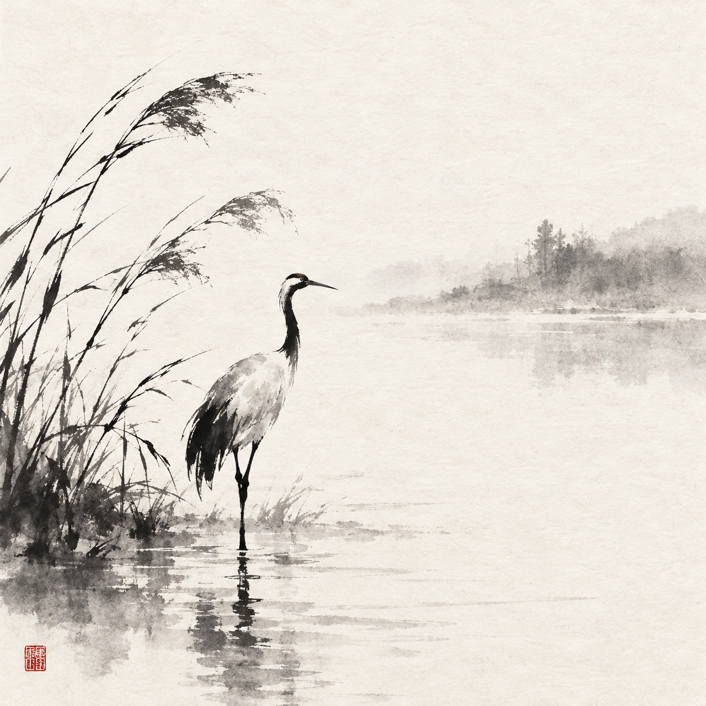

**A1-09 · 水墨 / 墨绘**（Sumi-e / Ink Wash）

看点：看点：鹤与苇一笔成形、远岸洇成淡灰，大片留白当作水与雾——负空间是水墨语言，不是没画完。

<details><summary>📋 完整提示词（GPT 正文，复制即用）</summary>

```text
Sumi-e ink wash painting: a lone crane standing in shallow water beside wind-bent reeds. Work almost entirely in black ink modulated only by water, drawing the reed stems and crane legs as unhesitating single strokes that taper from loaded bristle to dry tip, and washing the far bank into soft gray bleed. Allow absorbent rice paper to drink the pigment so every edge feathers naturally, and leave vast regions of untouched white standing in for mist and open water so that negative space carries nearly a third of the composition. Place one small red seal square in a corner. No modern text, logos or photographic effects.
```

</details>

</td>
</tr>
<tr>
<td valign="top" width="50%">

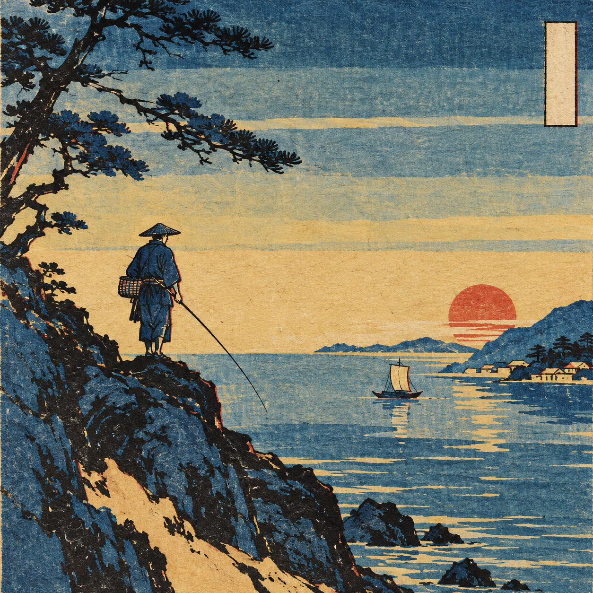

**A1-10 · 浮世绘 / 木版画**（Ukiyo-e Woodblock）

看点：看点：粗轮廓线勾边、色块平涂、天空横向渐层、和纸纤维透出——木版画的工艺痕迹要留在画面里。

<details><summary>📋 完整提示词（GPT 正文，复制即用）</summary>

```text
Ukiyo-e woodblock print: a lone fisherman standing on a rocky outcrop at dawn, with a calm bay and distant hills behind him. Confine yourself to flat blocks of hand-mixed mineral color, indigo, soft vegetable yellow and muted red, each bounded by a confident black key line with no modeling or soft edges anywhere in the image. Let the fibrous tooth of washi paper show through the ink, add faint horizontal bokashi banding across the sky, and admit slight misregistration where a second block landed off its mark. Compose with a dominant diagonal, heavy asymmetry and an empty horizontal band at the horizon. Include one small empty cartouche. No readable characters, logos or watermarks.
```

</details>

</td>
<td valign="top" width="50%">

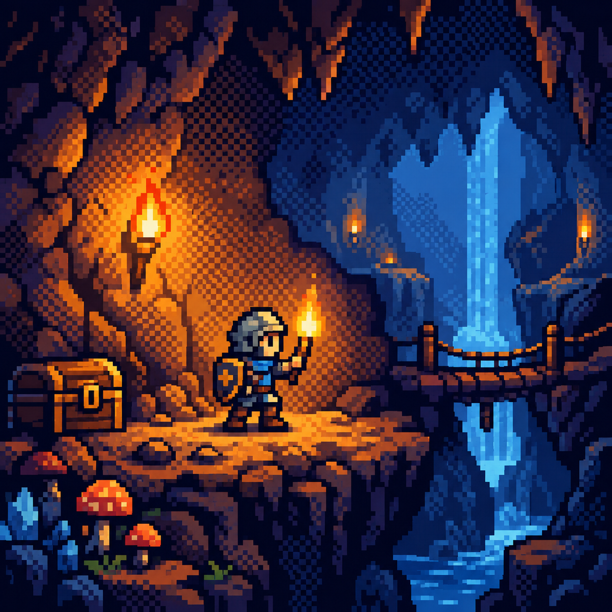

**A1-11 · 像素画**（Pixel Art）

看点：看点：像素格子清晰、色板受限、抖动过渡，缩到图标大小仍认得出剪影——16-bit 不是「模糊的小图」。

<details><summary>📋 完整提示词（GPT 正文，复制即用）</summary>

```text
Pixel art game sprite scene: a small armored hero standing in a torchlit cave, rendered at true one-to-one pixel resolution. Restrict the palette to roughly sixteen deliberate colors with no anti-aliasing blended between them, and place every individual pixel by hand, using ordered dithering to grade the torch light falloff across the cavern walls and cluster dithering for ambient shadow. Give the sprite a dark outline, exactly three shades of value per material, and a silhouette that stays readable at thumbnail size. Keep all elements aligned to one consistent pixel grid. Add no blurring, no filters, no text, logos or watermarks.
```

</details>

</td>
</tr>
<tr>
<td valign="top" width="50%">

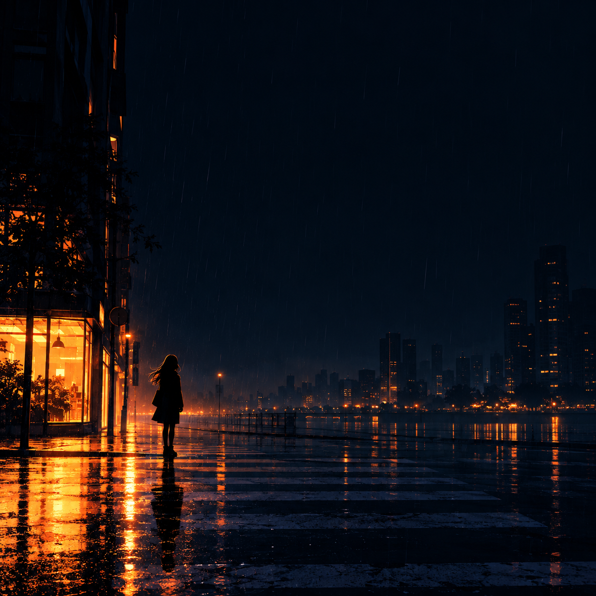

**A1-12 · 剪影 / 负空间**（Silhouette & Negative Space）

看点：看点：主体几乎全黑、只留一线轮廓光，人占画面极小而空处极大——负空间是被主动经营的构图。

<details><summary>📋 完整提示词（GPT 正文，复制即用）</summary>

```text
Silhouette and negative-space anime composition: a girl standing alone on a rain-slicked city crossing at night, rendered almost entirely as a black shape. Backlight her with warm shopfront glow that picks out only a thin rim of hair and shoulder while every interior detail dissolves, and let the surrounding space carry the information through smeared pavement reflections, drifting rain streaks and distant lit windows. Limit the scheme to deep blue-black plus a single accent color. Compose so the figure occupies a small part of a very large empty frame, honoring the negative space intentionally. No text, logos or watermarks.
```

</details>

</td>
<td valign="top" width="50%">

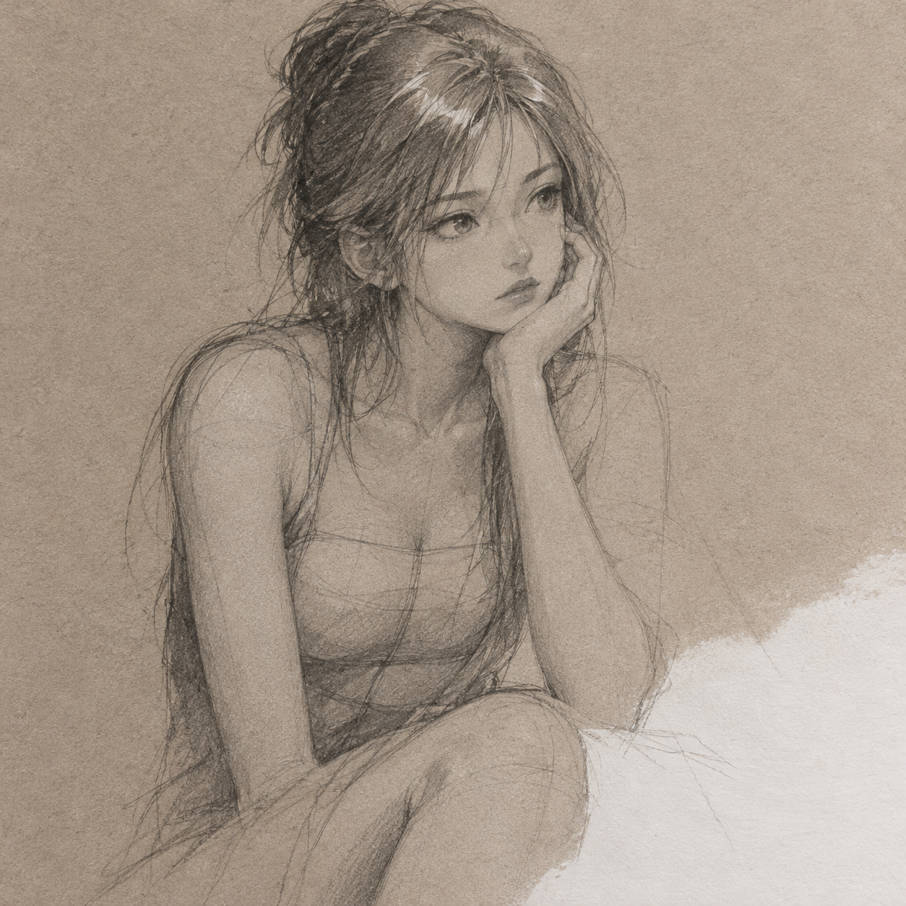

**A1-13 · 手绘草稿质感**（Pencil Sketch / Draft）

看点：看点：颅骨圆、中心线、胸腔块面都留在纸上，肩线有重复描摹的搜索痕迹，下半身未画完——过程感就是内容。

<details><summary>📋 完整提示词（GPT 正文，复制即用）</summary>

```text
Pencil sketch anime drawing left deliberately in draft state: a seated girl resting her chin on one hand, drawn on toned paper. Keep the construction legible, a light circle for the cranium, a center line, a blocked chest cage, and duplicated searching contour lines where the hand corrected the near shoulder. Vary graphite pressure so weight gathers on the underside of forms, smudge a few core shadows with a blending stump, and abandon the far arm and lower sheet unfinished as raw white paper. Add faint kneaded-eraser highlights lifted from the hair. Include no color, no inked lines, no text, logos or watermarks.
```

</details>

</td>
</tr>
<tr>
<td valign="top" width="50%">

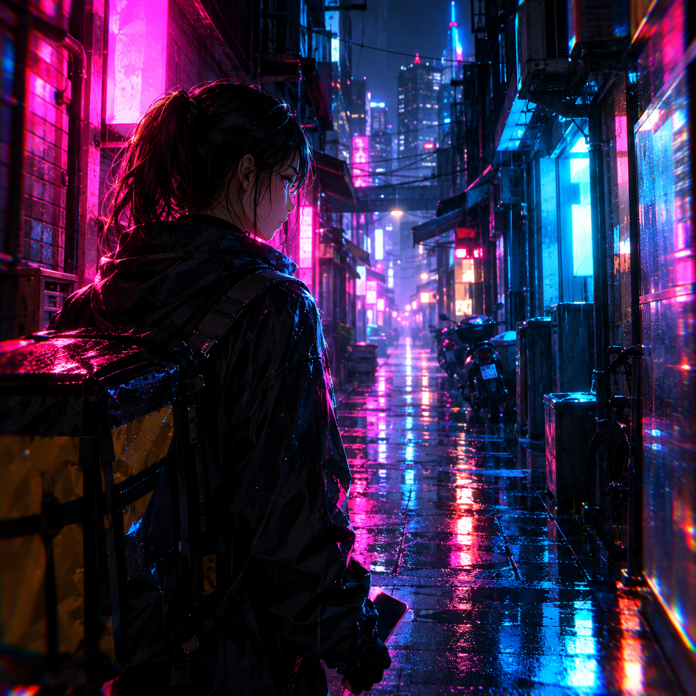

**A1-14 · 高对比霓虹 / 夜景摄影感**（Neon Night / Cyber Palette）

看点：看点：品红与青分别从两侧打光、湿地反光被拉成竖向光带，暗部压向纯黑——霓虹夜景靠光源颜色说话，不靠滤镜。

<details><summary>📋 完整提示词（GPT 正文，复制即用）</summary>

```text
High-contrast neon night anime illustration with photographic camera feel: a courier standing at the mouth of a rain-soaked alley in a dense city. Light the scene almost entirely from practical signage, magenta from one wall and cyan from the other, rimming her shoulders and catching the eyelashes, with almost no ambient fill so shadow areas crush toward black. Make every wet surface a broken mirror holding smeared colored reflections, and add gentle lens bloom with slight chromatic fringing toward the frame edges. Compose with strong perspective convergence and heavy atmospheric depth. Put no readable text on the signs, no logos, watermarks or UI overlays.
```

</details>

</td>
<td valign="top" width="50%">

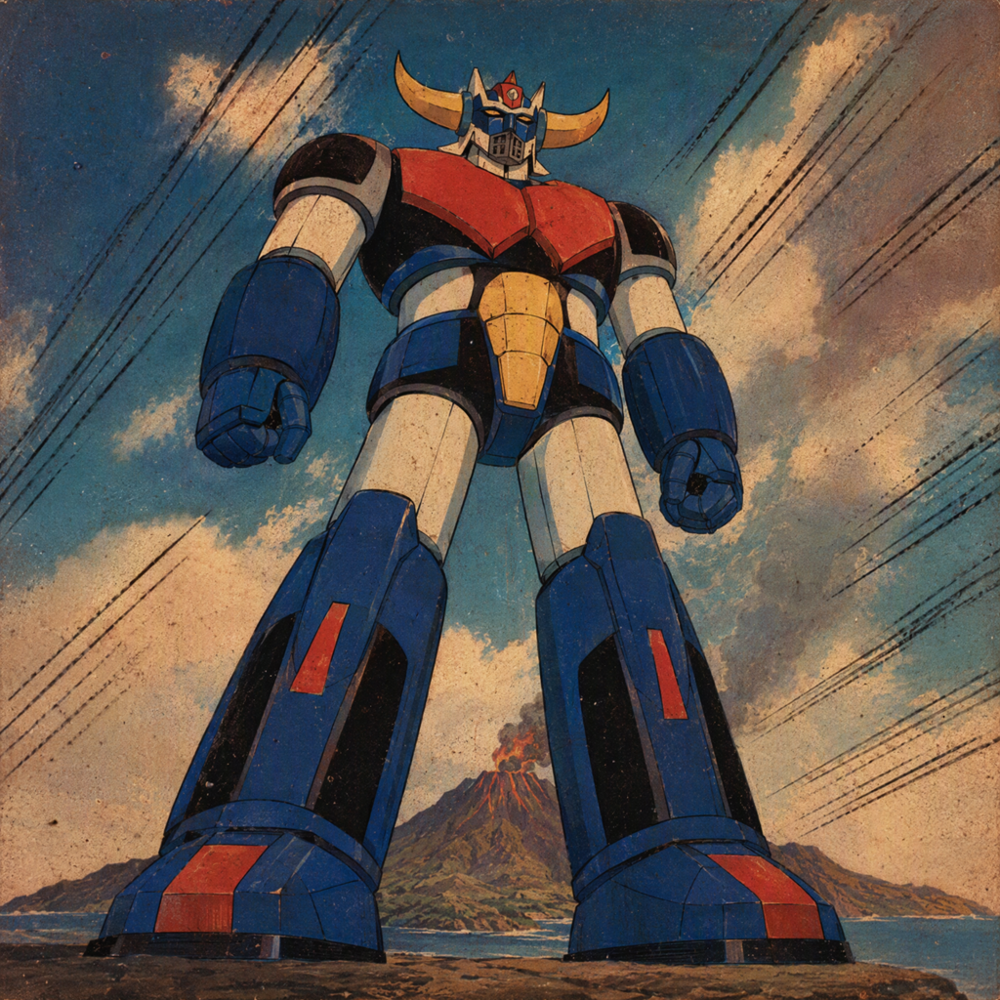

**A2-01 · 70 年代复古机器人动画**（Retro 70s Mecha Anime）

看点：看点：仰视角把敦实方正的机体顶天立地撑满画面，蓝白装甲配红色胸甲的渐变上色，背景火山喷发加放射状速度线，整图蒙一层低饱和做旧颗粒——70 年代海报感靠「有限」堆出来。

<details><summary>📋 完整提示词（GPT 正文，复制即用）</summary>

```text
Retro 1970s super-robot anime still: a chunky chest-heavy robot with a horned helmet standing against clear sky over a volcanic island. Reproduce the production reality of the period honestly, limited animation staging, flat hand-painted poster-like skies built from broad washes, heavy uniform ink outlines and simplified primary color plating broken by visible panel gaps rather than engraved surface detail. Add coarse 16mm film grain, faint gate weave, and highlights faded warm toward red as old prints do. Compose a heroic low-angle full-body shot with thick black speed lines raking past. Keep it mechanical and hand-made rather than cleanly rendered. No text, logos or watermarks.
```

</details>

</td>
</tr>
<tr>
<td valign="top" width="50%">

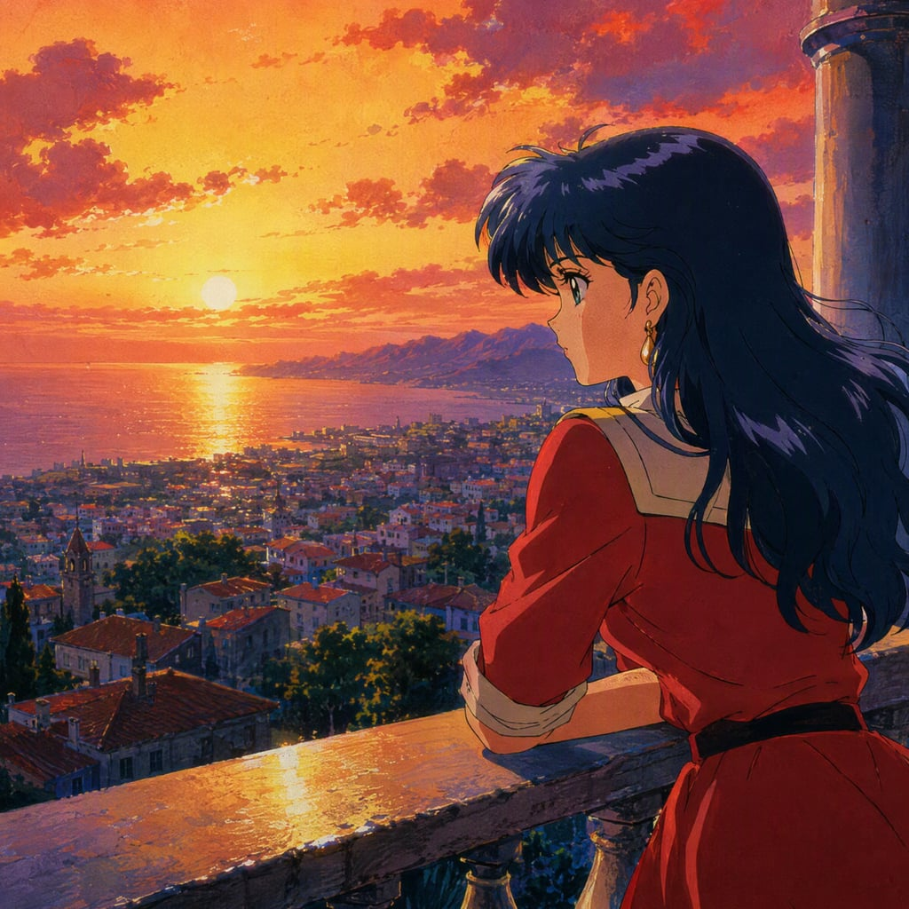

**A2-02 · 80 年代黄金赛璐璐**（80s Golden Age Cel）

看点：看点：水粉厚涂的黄昏城市背景有真实空气纵深，夕阳海面与云层是多层色叠出来的；角色则是干净的两层色赛璐璐，阴影块锐利——「手绘背景 × 赛璐璐角色」的叠合一眼可辨，整图暖橙对深蓝的黄金年代配色。

<details><summary>📋 完整提示词（GPT 正文，复制即用）</summary>

```text
Golden-age 1980s anime cel animation still: a young heroine leaning on a balcony railing at sunset above a seaside town. Recreate the peak hand-painted look with dense opaque poster-color background art carrying genuine atmospheric depth, characters laid over it in crisp clean line art with two-tone shading, and rich saturated primaries rather than modern pastel keying. Include the analog qualities of an actual film capture, photographic cel grain, slight color registration drift where the camera ran hot, and gentle specular bloom off polished railings and hair. Compose it like a theatrical key visual with unhurried depth. Include no text, logos, watermarks or modern digital effects.
```

</details>

</td>
<td valign="top" width="50%">

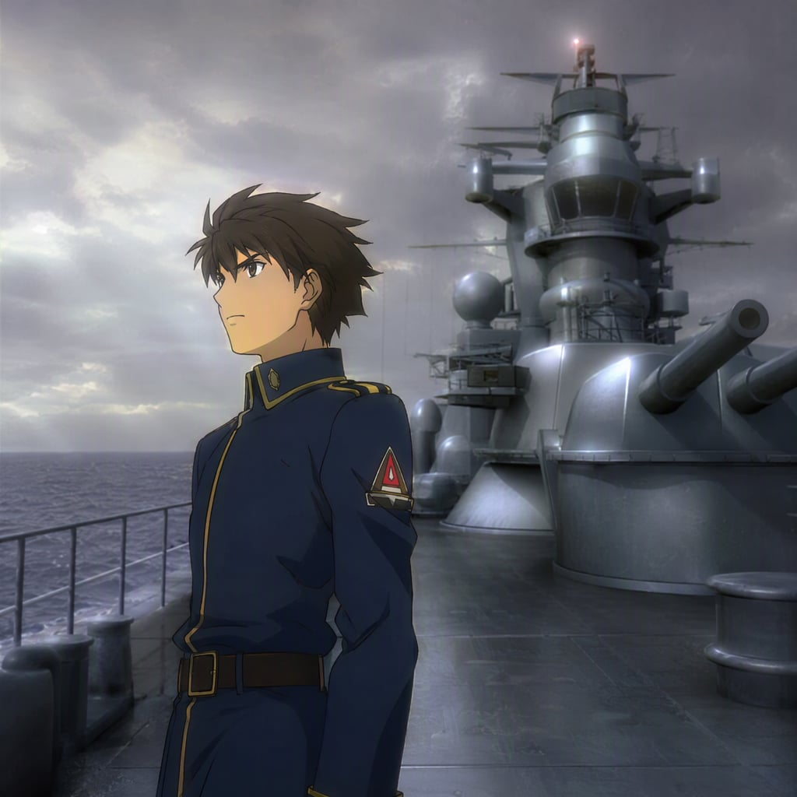

**A2-04 · 00 年代过渡期数码**（Early 2000s Digital）

看点：看点：军装少年侧身立于战舰甲板，发丝与金属炮塔的高光带着数码后期 bloom 的油光，阴云天空是干净的渐变渲染——00 年代「胶片感退场、锐利登场」的过渡质感。

<details><summary>📋 完整提示词（GPT 正文，复制即用）</summary>

```text
Early 2000s transitional anime still: a hero standing on the deck of a partly computer-generated battleship beneath an overcast sky. Mix the two technologies exactly as studios did then, character rendered with suspiciously uniform digital lineart and flat cel shading, matte-painted background carrying hybrid atmospheric effects, and a three-dimensional vehicle whose surface shading and lack of line quality read as visibly foreign next to the hand-drawn figure. Add the era's signature soft glow bloom across every highlight and mild edge aliasing where layers were composited. Compose as a 4:3 episode frame with restrained camera movement. No text, logos or watermarks.
```

</details>

</td>
</tr>
<tr>
<td valign="top" width="50%">

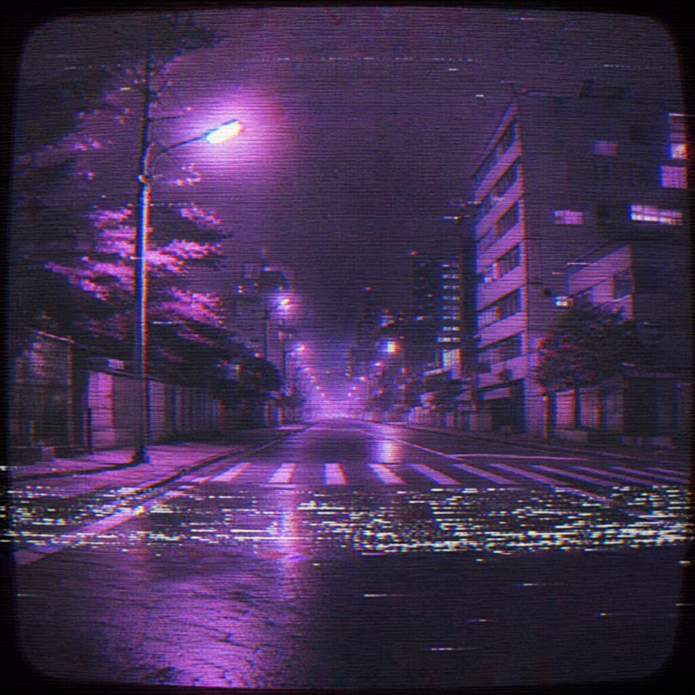

**A2-07 · 录像带 VHS 噪波**（VHS / Analog Tape）

看点：看点：整图压进一台显像管电视里——圆角暗角、横向扫描线、紫色色度溢出，画面底部一条磁迹噪波带把湿漉漉的夜路搅花，介质损伤本身就是画面语言。

<details><summary>📋 完整提示词（GPT 正文，复制即用）</summary>

```text
VHS analog tape capture aesthetic applied to an anime frame: an empty late-night city street seen through a worn consumer recording. Degrade it convincingly with heavy chroma bleed smearing color to the right of every bright edge, low-resolution luma softness, horizontal tracking distortion bands drifting across the lower third, occasional dropout flicker lines, and pronounced scanlining over the whole picture. Push the color toward bleeding magenta and crushed blacks with milky lifted shadows, then add faint curved CRT vignetting at the corners. Keep it authentically lo-fi rather than a clean modern digital filter. Include no readable text, logos or watermarks.
```

</details>

</td>
<td valign="top" width="50%">

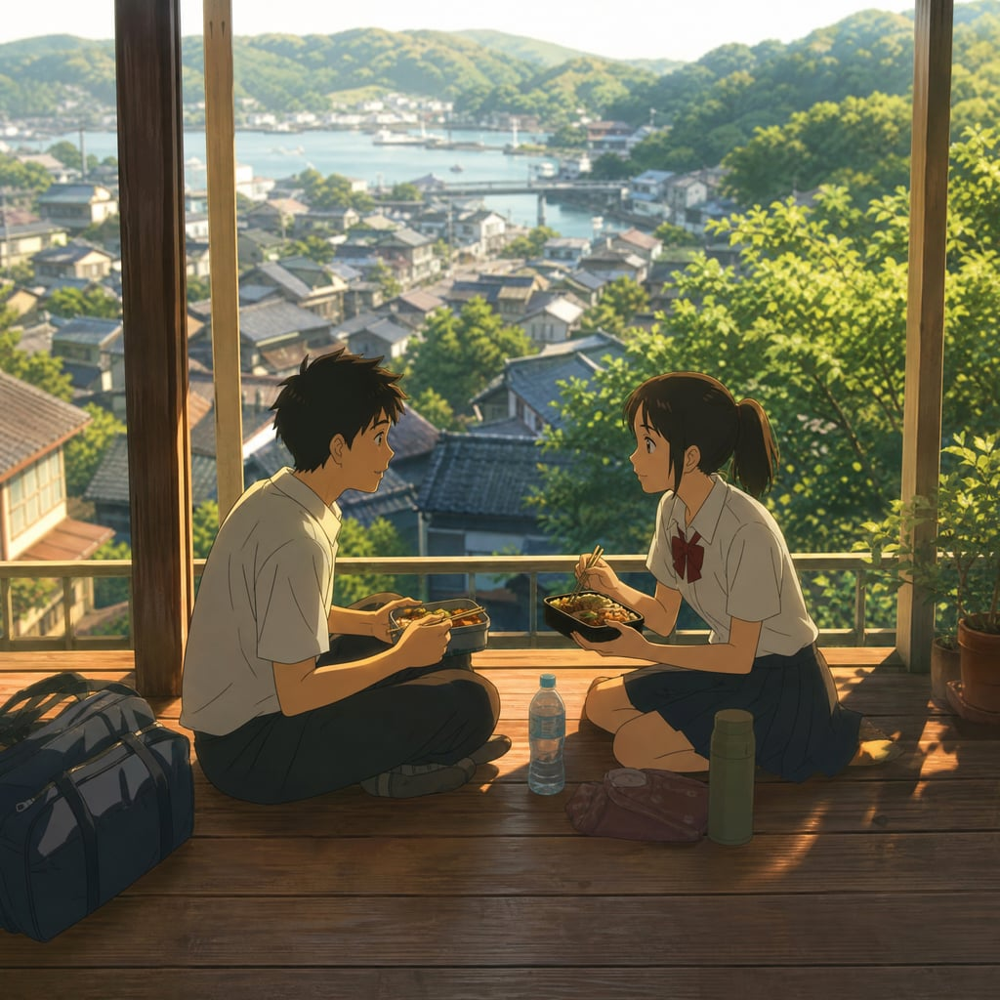

**A3-14 · Studio Colorido（3D 融合）**（Studio Colorido）

看点：看点：临海木廊上午餐的两个学生，远景小镇与海湾用柔和厚涂铺出空气纵深，逆光给发丝镶了一圈暖边——2D 线条与 3D 渲染融在同一片阳光里，明亮通透正是 Colorido 式的招牌。

<details><summary>📋 完整提示词（GPT 正文，复制即用）</summary>

```text
Studio Colorido style anime still with integrated three-dimensional backgrounds: two students eating lunch on a wooden veranda above a sunlit town. Blend hand-drawn characters into dimensionally correct rendered environments, true camera volume and believable light falloff, soft indirect bounce off the floorboards onto the figures, and photographic depth of field separating them from a convincingly real town below. Keep the character rendering soft and warm, matching its highlight direction exactly to the rendered light so nothing floats. Compose the whole frame around warm everyday domestic tone and modest exposure. No text, logos or watermarks.
```

</details>

</td>
</tr>
<tr>
<td valign="top" width="50%">

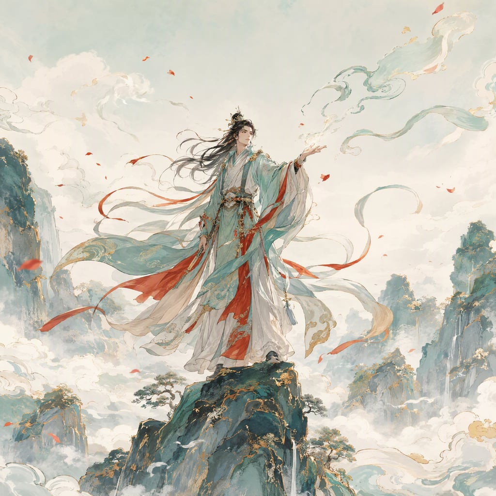

**A4-01 · 国产二维动画风**（Chinese 2D Anime (Donghua)）

看点：看点：仙侠人物立于云山之巅，长绸飘带用水墨晕染，山石皴法混着绢本设色与洒金——国产二维动画里「画水墨」的那一路，留白比填满更重要。

<details><summary>📋 完整提示词（GPT 正文，复制即用）</summary>

```text
Chinese two-dimensional donghua illustration: a young cultivator standing on a floating cloud-sea peak with ribbon streamers trailing through the air. Combine the regional hallmarks, extremely fine calligraphic linework that tapers like brush writing, a cool celadon and vermilion scheme lifted by gold ink accents, costume built from layered silk with embroidered cloud-pattern trim, and scenery drawn from stylized Chinese landscape painting rather than photographic reference. Render drifting petals and released spiritual energy as ribbon-like strokes with meaningful negative space between them. Compose a vertical full-body key visual leaving generous open sky above. No text, logos or watermarks.
```

</details>

</td>
<td valign="top" width="50%">

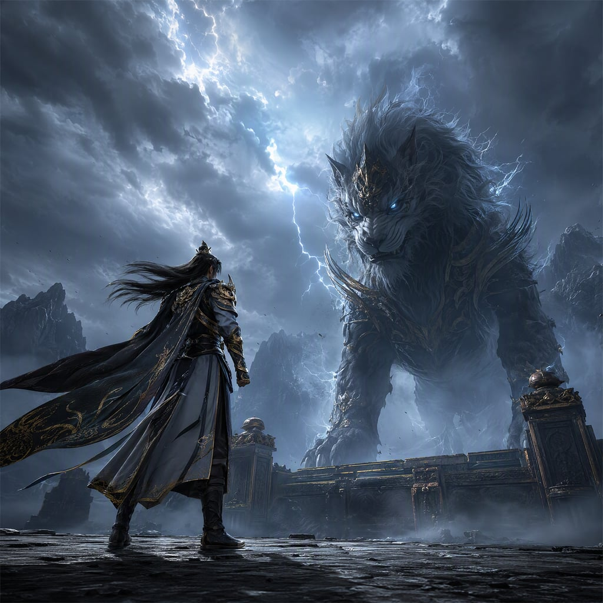

**A4-02 · 国产三维动漫 CG**（Chinese 3D CG Donghua）

看点：看点：铠甲角色与雷云巨兽对峙的 CG 电影感——次表面散射的皮肤、金属高光、体积雾与闪电，戏剧光比一拉满就是国产三维动画的游戏 CG 味。

<details><summary>📋 完整提示词（GPT 正文，复制即用）</summary>

```text
Chinese three-dimensional CG donghua production frame: an armored cultivator facing a spirit beast atop a stone platform in storm light. Render it as high-end semi-realistic cinematic work, clean subsurface-scattered skin with visible pore detail, physically based fabric showing sheen on embroidered silk brocade, groomed hair with individual strand highlights catching the lightning, and heavy volumetric storm lighting with shafts through cloud. Keep the faces stylized toward anime ideals while the world around them stays photographic, and add layered particle dust and drifting mist elements. Compose an epic wide frame with the camera orbiting low and slow. No text, logos or watermarks.
```

</details>

</td>
</tr>
<tr>
<td valign="top" width="50%">

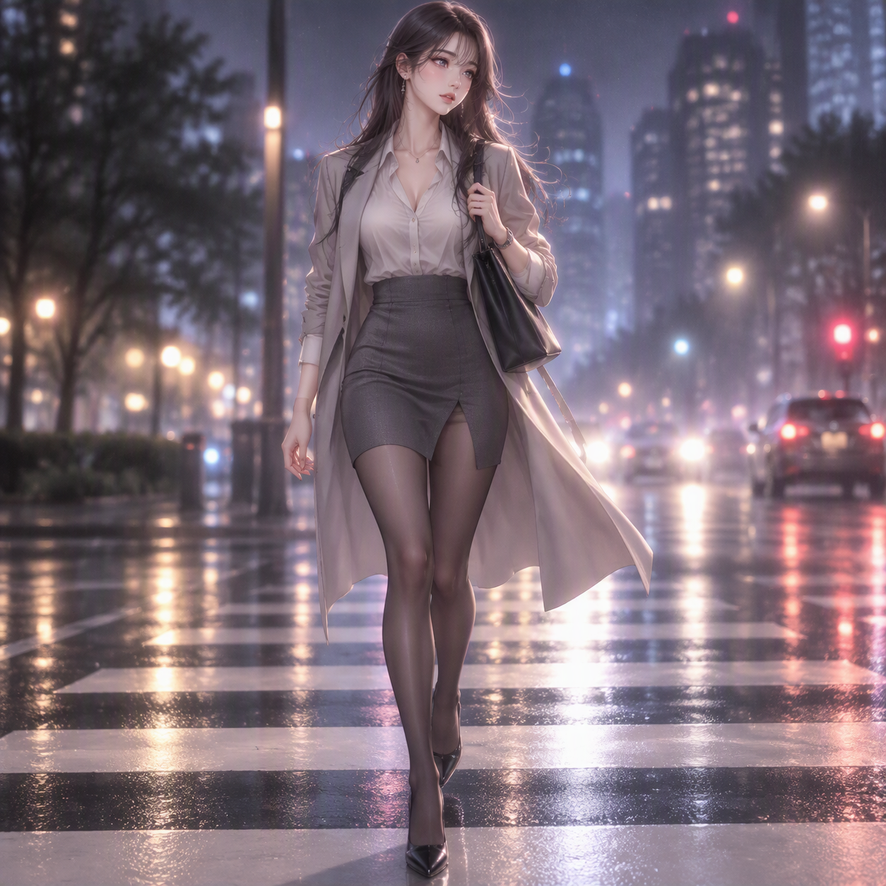

**A4-07 · 韩漫 / Webtoon 条漫**（Webtoon / Manhwa）

看点：看点：雨夜斑马线上的职场女性，真人比例加精修发丝与质感刻画，霓虹散景铺满背景——韩漫封面式的高个写实系，与日系萌版一眼可分。

<details><summary>📋 完整提示词（GPT 正文，复制即用）</summary>

```text
Korean webtoon and manhwa style vertical composition: a fashionable office worker crossing a lit crosswalk at night, built for phone scrolling. Apply the finish accurately, heavily airbrushed soft shading with almost no hard edge anywhere on the body, extremely detailed eyes rendered with dozens of highlight shapes and concentric iris rings, flawless skin with blushed cheeks and a defined cupid's bow, contemporary fashion drawn down to individual fabric textures, and background elements simplified or dissolved into gradient fog. Keep everything tall and centered so no important shape touches the side margins. Compose a full-body vertical. No text, logos or watermarks.
```

</details>

</td>
<td valign="top" width="50%">


**A4-08 · VTuber / 虚拟主播立绘**（VTuber Character Art）

看点：看点：银发双马尾加头戴耳机话筒的半身立绘，渐变圆形背景、透明感高光与糖果配色——直播软件框里「看板娘」的标准规格。

<details><summary>📋 完整提示词（GPT 正文，复制即用）</summary>

```text
VTuber Live2D character key art: a brightly designed virtual streamer waving at the viewer in an open frontal pose. Build her for appeal at thumbnail size, a highly saturated coordinated scheme using two dominant hues plus white and one accent, layered accessories such as asymmetric hair ornaments, a headset, and clothing panels carrying subtle tech motifs, large expressive eyes with multiple sparkle highlights, and clean even linework free of rendering noise. Keep the gesture open and frontal so the silhouette reads immediately, and set her against a simple soft gradient or patterned circle. No text, logos or watermarks.
```

</details>

</td>
</tr>
<tr>
<td valign="top" width="50%">

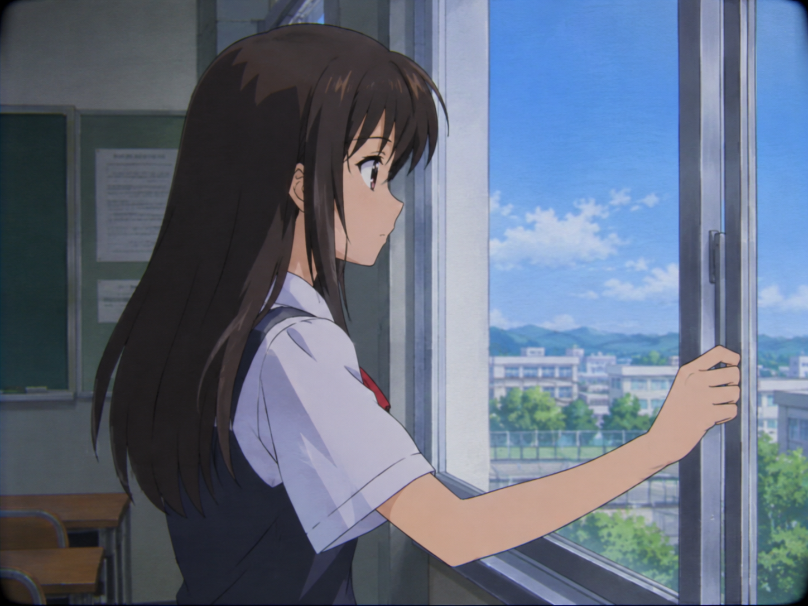

**A4-09 · 动画截图感**（Anime Screencap Simulation）

看点：看点：教室窗边的 4:3 画幅加暗角，角色按 TV 作画收线、背景教学楼按真实透视虚化——模拟的正是播放器里随手暂停的那一帧。

<details><summary>📋 完整提示词（GPT 正文，复制即用）</summary>

```text
Anime screencap simulation: a quiet moment of a girl sliding open a classroom window, rendered as though lifted straight off a broadcast episode. Reproduce broadcast reality faithfully, correct television aspect rather than print proportions, very slight interlace grain, mild chroma softness typical of analog-to-digital transfer, and compression-friendly flat color decisions with no illustrative embellishment added by an artist. Keep the composition functional and unremarkable like a real cut, characters placed off-center, props clipped at the frame edges, and no hero lighting or rim light anywhere. Add faint corner darkening from old broadcast matting. Include no subtitles, logos, watermarks or UI.
```

</details>

</td>
<td valign="top" width="50%">

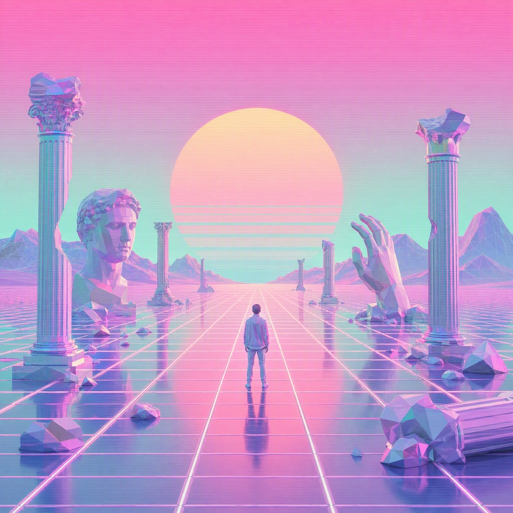

**A4-10 · Vaporwave / 复古未来主义**（Vaporwave Retro-Futurism）

看点：看点：粉青渐变天空、条纹落日、透视网格地面，大理石头像与断柱撒了一路——vaporwave 符号表全齐，一切都塑料般光滑。

<details><summary>📋 完整提示词（GPT 正文，复制即用）</summary>

```text
Vaporwave retro-futurist illustration: a lone figure standing before an endless chrome grid receding toward an enormous pastel sun. Assemble the aesthetic deliberately from its parts, primitive wireframe computer graphics and low-polygon objects rendered with naive flat lighting, gradient skies running hot pink into soft teal, chrome extrusions mirroring that same gradient across their bevels, and scattered fragments of classical statuary standing in for scenery. Lay a hazy scanline atmosphere over the whole frame and keep a strict pastel script with no pure black. Compose symmetrically around one strong vanishing point. No readable text, logos, watermarks or UI.
```

</details>

</td>
</tr>
<tr>
<td valign="top" width="50%">

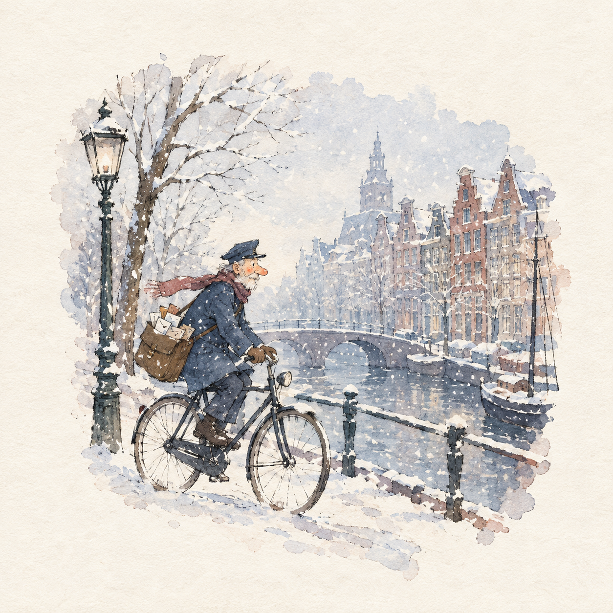

**A5-05 · 欧式绘本水彩**（European Picture Book Watercolor）

看点：看点：雪天运河边的骑车邮差，水彩在湿纸上晕开砖红与灰蓝，雪花留白靠纸面底色透出来——欧式绘本的「松散笔触 + 满纸生活气」。

<details><summary>📋 完整提示词（GPT 正文，复制即用）</summary>

```text
European picture-book watercolor illustration: an elderly postman cycling past canal houses during first snow. Keep the handling loose and literate, dry-brush ink contours drawn with a worn nib so the line skips and scratches across the paper texture, watercolor pooled unevenly and allowed to run past the drawn edge in places, a restrained palette of slate blue and dusty rose, and bare paper showing through the majority of the surface. Give the figures whimsical slightly awkward proportions and let atmospheric perspective carry the storytelling. Leave a wide clean margin of untouched paper around the whole scene. No text, logos or watermarks.
```

</details>

</td>
<td valign="top" width="50%">

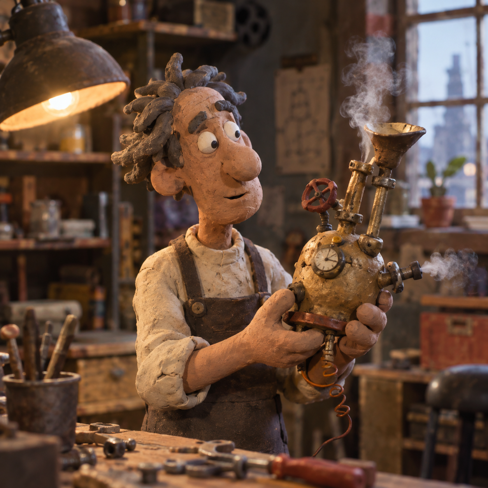

**A5-06 · 黏土定格动画**（Claymation / Stop Motion）

看点：看点：黏土捏制的老发明家捧着蒸汽装置，指纹与刀痕留在黏土表面，棚灯打出一铸铁工作台的实物感——定格动画的魅力是「每个 imperfection 都是手做的证据」。

<details><summary>📋 完整提示词（GPT 正文，复制即用）</summary>

```text
Claymation stop-motion still: a lumpy clay inventor standing in his cluttered workshop holding a sputtering brass contraption. Make the material absolutely convincing, every surface covered in fingerprints, thumb dents and fingernail smoothing marks, faint seams where separately sculpted pieces were joined, and tiny dust motes clinging to the plasticine. Give the props slightly wrong proportions because a human hand built them quickly, and leave tell-tale imperfections such as chipped elbow edges and relief from the internal armature at the neck. Light it as a genuine miniature set with practical lamp bounce and very shallow depth of field. No text, logos or watermarks.
```

</details>

</td>
</tr>
<tr>
<td valign="top" width="50%">

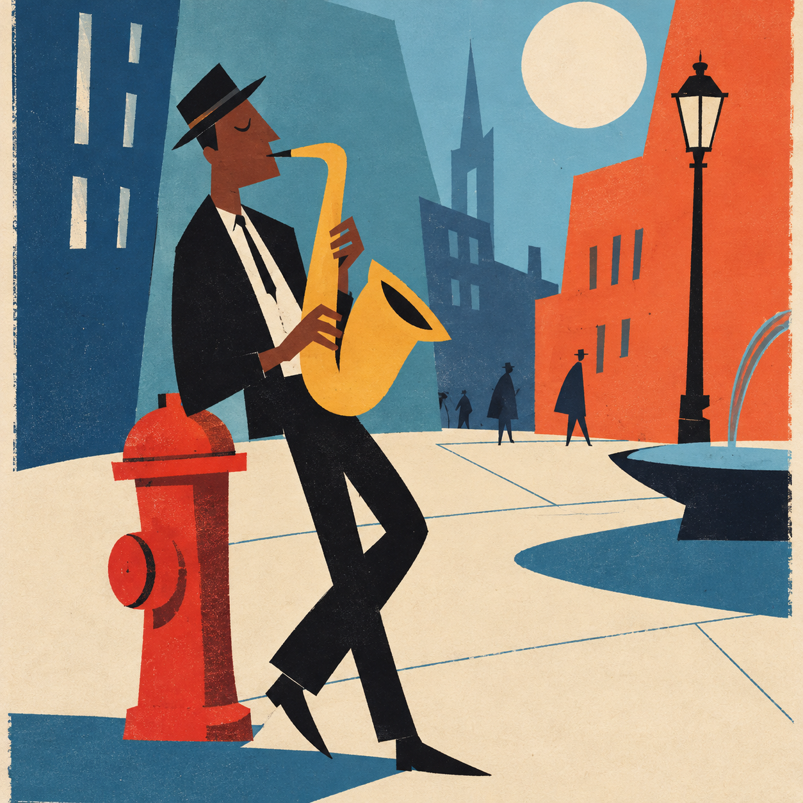

**A5-08 · 有限动画现代主义**（UPA / Limited Animation Modernism）

看点：看点：萨克斯手由三四个大色块拼成，帽檐、楼群、月亮全是几何剪影，米白纸底托住红蓝橙三色——「少画但每一笔都是设计」的 UPA 法则。

<details><summary>📋 完整提示词（GPT 正文，复制即用）</summary>

```text
Modernist limited-animation still in the UPA tradition: a jazz musician leaning against a hydrant in a stylized city square. Honor the mid-century design revolt, figures reduced to graphic abstracted marks, bold flat areas of unmodeled color with no attempt at realistic shading, deliberate anatomical distortion in service of the line rather than the body, and a background laid out like a modernist poster with skewed off-kilter perspective and unexpected negative counter-forms. Add print-like ink texture and edges sitting very slightly off register. Compose strong asymmetric balance like a screenprint. No text, logos or watermarks.
```

</details>

</td>
<td valign="top" width="50%">

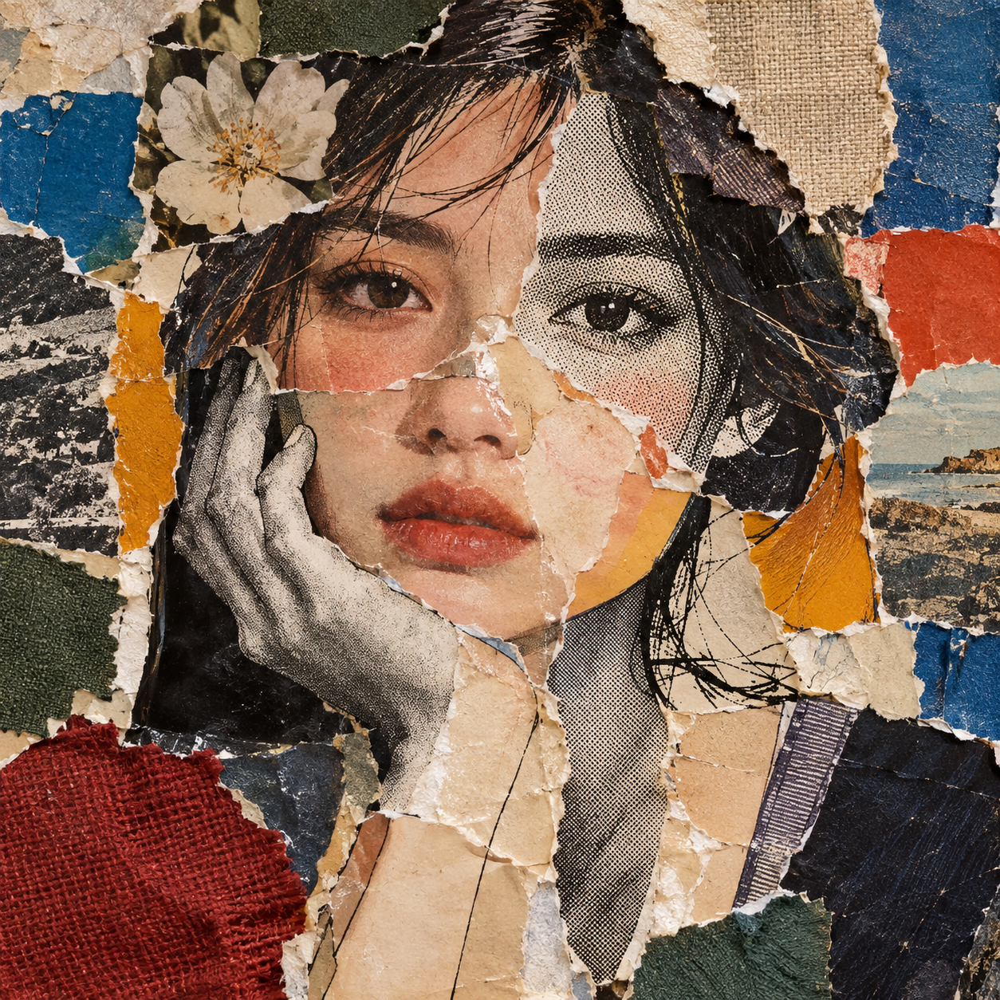

**A5-09 · 拼贴与混合媒介**（Collage & Mixed Media）

看点：看点：人脸被撕碎的报纸、油彩与布纹拼贴重组，断口毛边与拼缝全部保留——混合媒介的魅力在「每一块纸来自不同的世界」。

<details><summary>📋 完整提示词（GPT 正文，复制即用）</summary>

```text
Collage and mixed-media animated still: a woman's portrait assembled entirely from torn paper, fabric swatches and cut photographic fragments. Exploit the physical layering, torn fiber edges catching light with real thickness, mismatched scale between pasted elements so the hand and face were clearly printed separately, visible glue sheen and buckling paper, and seams left deliberately unresolved where two source images meet. Let different regions flip between drawn line, printed halftone and flat painted block. Compose the figure frontally against a heavily worked textured ground. Keep it tactile and assembled, never digitally smooth. No readable text, logos or watermarks.
```

</details>

</td>
</tr>
<tr>
<td valign="top" width="50%">

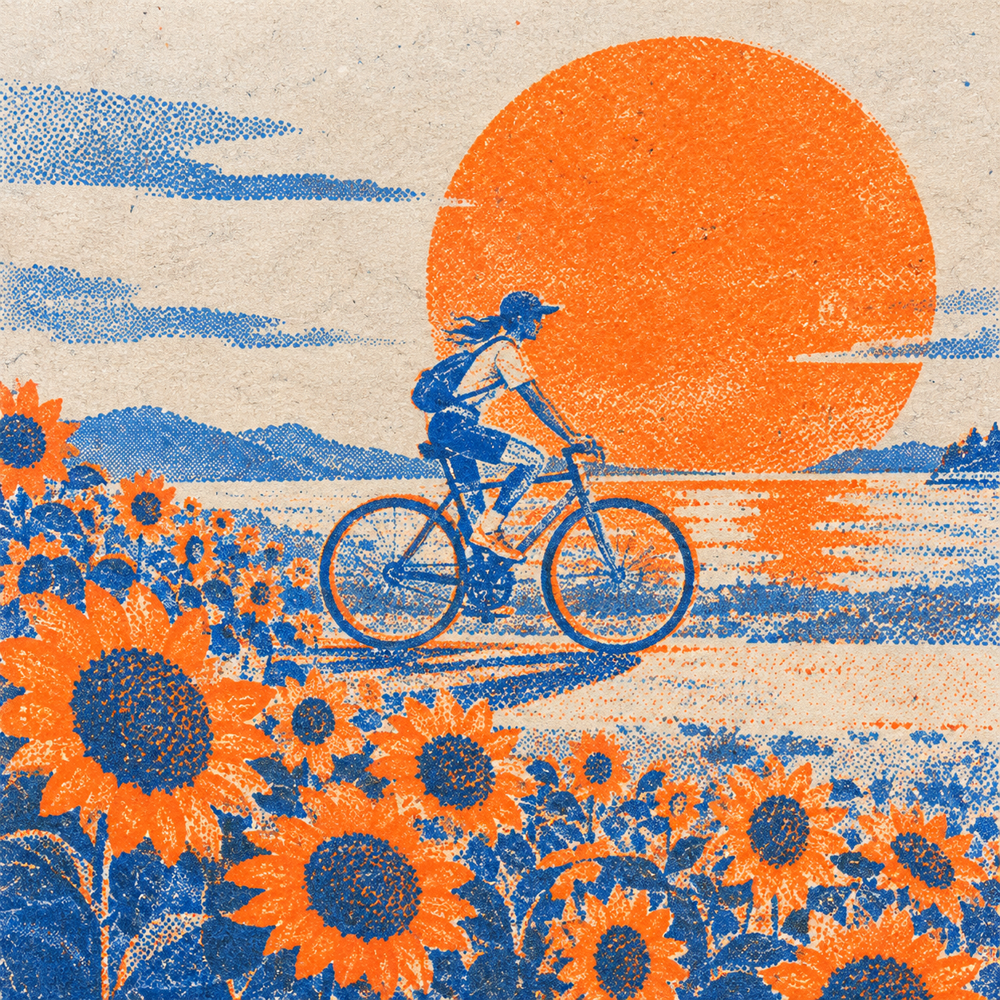

**A5-10 · 孔版印刷质感**（Risograph Print Indie）

看点：看点：橙蓝双色孔版印刷，套色边缘颗粒错位，向日葵和落日共用同一种橙——riso 的低保真限制感就是风格本身。

<details><summary>📋 完整提示词（GPT 正文，复制即用）</summary>

```text
Risograph print style indie illustration: a cyclist riding past sunflowers beneath an enormous low sun. Restrict yourself to two spot colors, fluorescent orange and medium blue, printed as separate translucent layers so every overlap produces one predictable third color. Run the registration slightly off so one layer drifts a few millimetres across the sheet, and let the ink land as coarse halftone dot pattern with uneven coverage, occasional voids and soft mottling where the drum ran dry. Use matte absorbent paper with visible fiber. Compose flat and poster-like with no depth illusion. No readable text, logos or watermarks.
```

</details>

</td>
<td valign="top" width="50%">

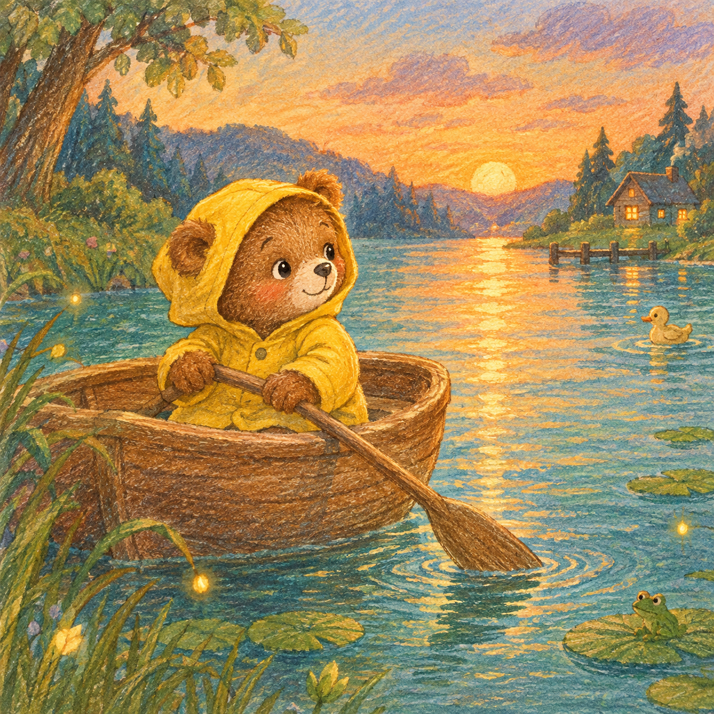

**A5-11 · 童书绘本插画**（Picture Book Illustration）

看点：看点：穿雨衣的小熊划船，蜡笔质感的水面反光与萤火虫点缀，暖黄落日对青绿树林——童书绘本的「安全感构图」，每个元素都圆润无害。

<details><summary>📋 完整提示词（GPT 正文，复制即用）</summary>

```text
Children's picture-book illustration: a small bear in a yellow raincoat rowing a wooden boat across a pond at dusk. Draw for a young reader, soft rounded forms with no sharp corners anywhere in frame, friendly characters with large eyes and instantly legible expressions, gently wobbly hand-drawn outlines, and a warm storybook scheme anchored by ochre and soft teal. Keep the composition simple with one obvious focal point, and give the environment just enough hidden detail to reward repeated looking. Build the texture from crayon and colored pencil strokes over visible paper grain. No text, logos or watermarks.
```

</details>

</td>
</tr>
<tr>
<td valign="top" width="50%">

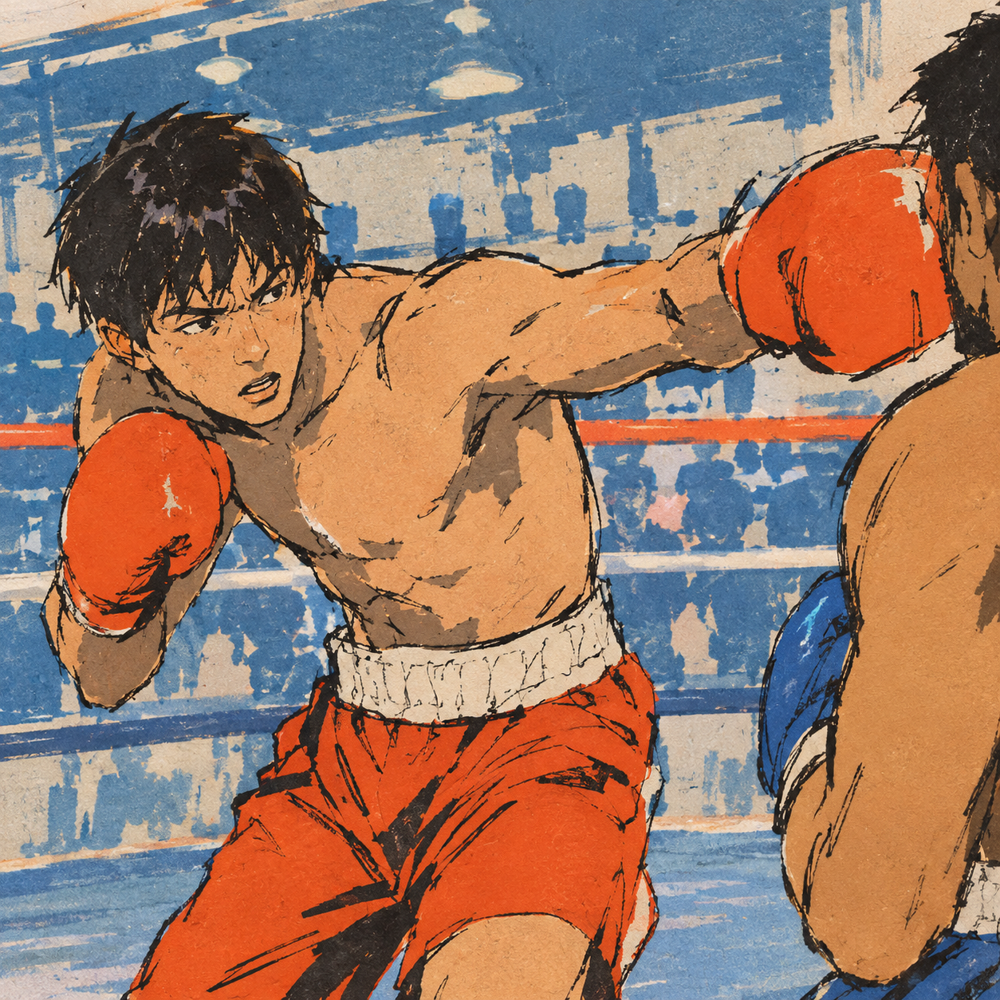

**A5-12 · 转描现实主义**（Rotoscoping）

看点：看点：真人转描质感的拳台对攻，肌肉结构逐帧写实、汗水与围绳投影保留实拍感，手绘上色只铺色块——转描的辨识度在「动起来像真人，停下来像版画」。

<details><summary>📋 完整提示词（GPT 正文，复制即用）</summary>

```text
Rotoscoped animation still: a boxer throwing a hook, traced frame by frame over live-action reference footage. Sell the uncanny accuracy of traced motion, every joint following what a real body actually did, which produces slightly wrong drawn proportions and shifting line quality as the tracer corrected between frames, with inked outlines wobbling erratically over the recorded movement instead of holding a steady contour. Keep the shading flat and sparse. Keep the background drawn loosely and differently from the figures so life and illustration sit uneasily together. Use flat limited color and no digital smoothing anywhere. No text, logos or watermarks.
```

</details>

</td>
<td valign="top" width="50%">

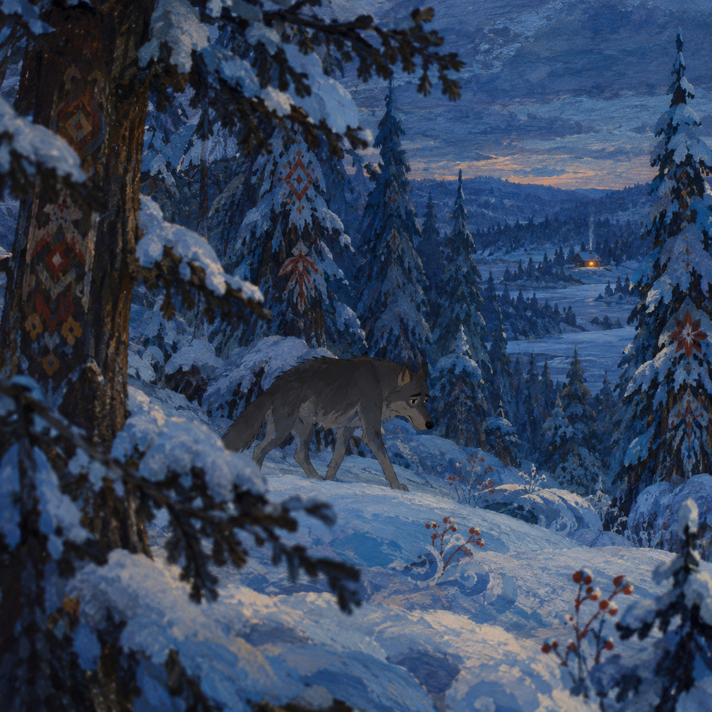

**A5-13 · 苏联 · 东欧手绘**（Soviet & Eastern European Hand-Drawn）

看点：看点：雪夜森林里的狼，油画厚涂的冷蓝调里只留一窗暖光，松枝积雪用沉静的老动画笔触——庄严、缓慢、带着童话的孤独感。

<details><summary>📋 完整提示词（GPT 正文，复制即用）</summary>

```text
Soviet and Eastern European hand-drawn animation still: a melancholy wolf walking through snow-heavy pine woods at blue twilight. Recreate the studio technique precisely, figures and scenery painted in gouache or oil directly on glass under the camera, producing soft smeared edges and a thick painterly surface, multiplane depth with separate foreground branches sliding past the animal, and Slavic folk ornament recurring inside the tree forms and drifted snow patterns. Hold the palette cold blue and umber broken only by one warm window glow far off. Compose a heavy wide shot with deep layered forest recession. No text, logos or watermarks.
```

</details>

</td>
</tr>
<tr>
<td valign="top" width="50%">

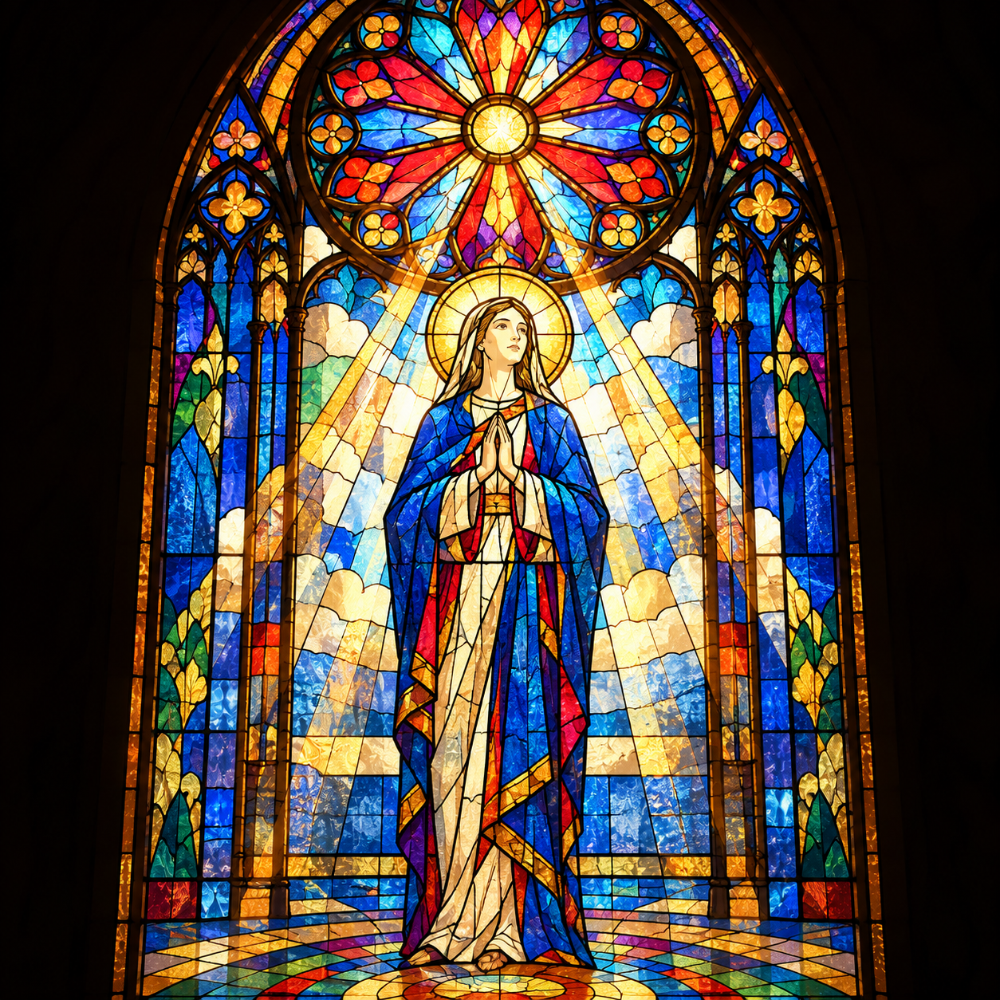

**A5-14 · 花窗玻璃与马赛克**（Stained Glass & Mosaic）

看点：看点：哥特尖拱窗里的圣母像，铅条分割色块、每格玻璃一种渐变，光从背后点燃整幅画面——花窗的透光感是普通插画模拟不出来的。

<details><summary>📋 完整提示词（GPT 正文，复制即用）</summary>

```text
Stained glass and mosaic animated still: a robed saint standing beneath a gothic rose window with light driving through it. Construct everything as leaded glass, every shape bounded by a heavy black lead line, infilled with flat translucent jewel color, the whole lit from behind so that light passes through the material rather than reflecting off its surface. Add irregular bubble striations and variation within each glass piece, gold leaf accents throwing stronger beams into the air, and mosaic tile work across the floor. Compose with hard vertical symmetry and keep nothing crossing outside the window arch. No readable text, logos or watermarks.
```

</details>

</td>
<td valign="top" width="50%">

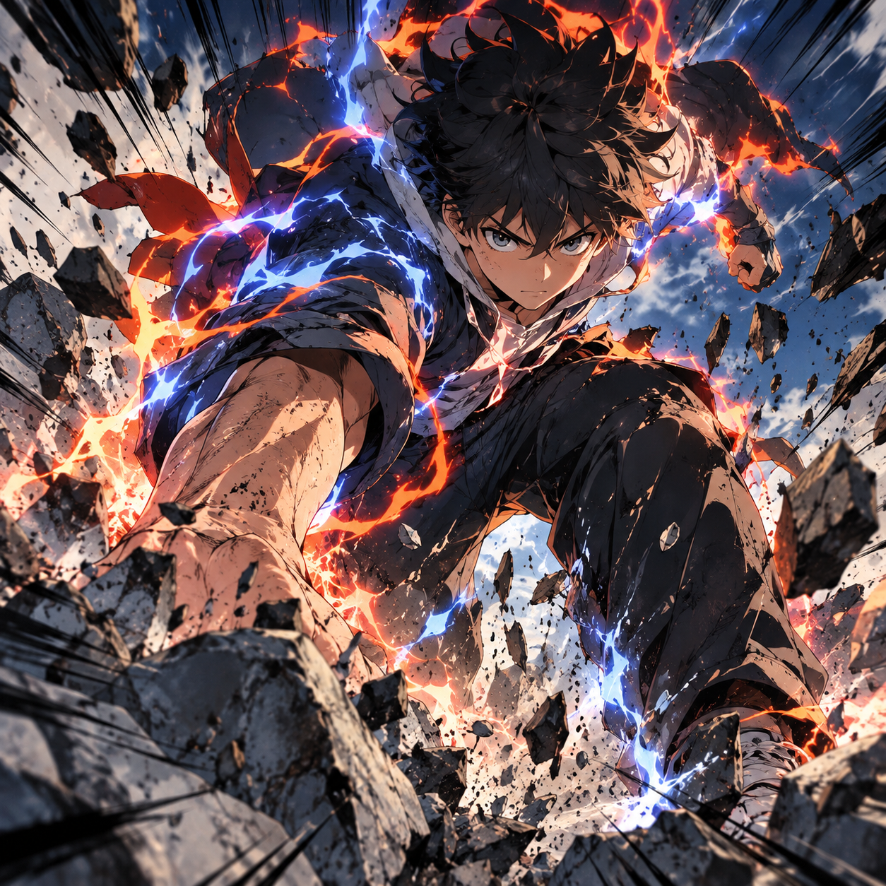

**G-01 · 热血战斗**（Battle Shonen）

看点：看点：全力一拳砸碎地面的瞬间，橙红能量与蓝电缠在拳峰，碎石向四面八方炸开——少年战斗的「决定性一击」四件套：姿势、集中线、冲击帧、能量气场。

<details><summary>📋 完整提示词（GPT 正文，复制即用）</summary>

```text
Battle shonen anime illustration: a teenage fighter launching forward through shattered concrete with energy crackling off his shoulders. Use the genre's full vocabulary, one extreme dynamic action pose with readable weight transfer and a single fully extended limb, radial debris implying the impact frame, hard ink speed lines converging on the point of contact, and layered aura effects in a hot secondary hue wrapping the silhouette. Keep the expression resolute rather than screaming. Compose from a low three-quarter angle so he feels larger than the frame, with the camera slightly rotated. Include no text, logos, watermarks or UI elements.
```

</details>

</td>
</tr>
<tr>
<td valign="top" width="50%">

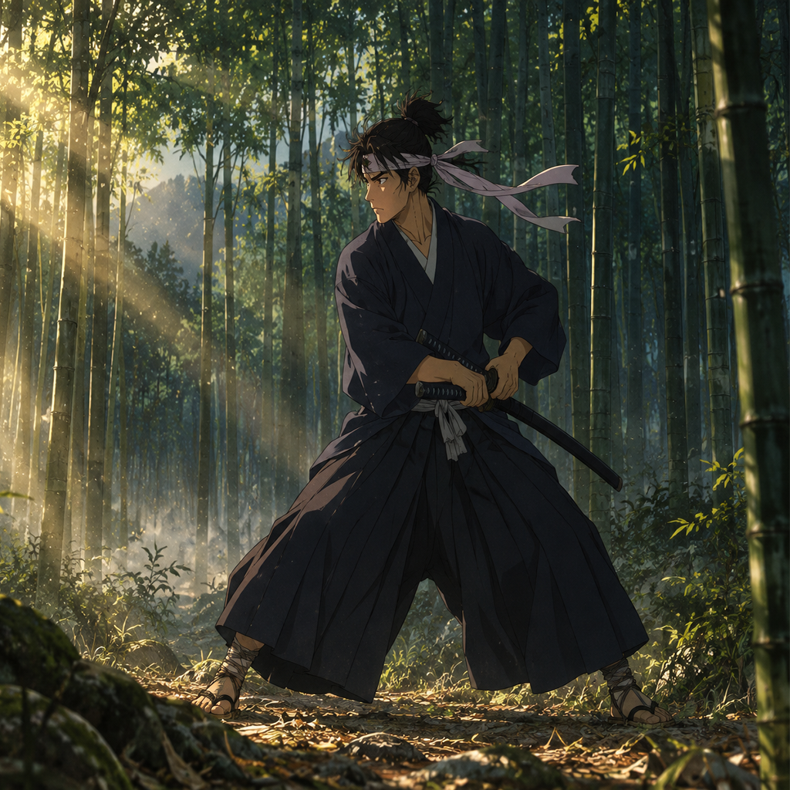

**G-03 · 忍者 / 武士**（Ninja & Samurai）

看点：看点：竹林光柱下的拔刀姿态，黑色羽织压低重心，视线与刀同向——武士题材靠「静中的紧绷」，环境越安静杀气越重。

<details><summary>📋 完整提示词（GPT 正文，复制即用）</summary>

```text
Japanese historical action anime still: a swordsman in dark indigo hakama holding iaijutsu stance in a bamboo forest at dawn. Draw the period accurately, layered kosode and hakama with correct wrapped seams and tied obi, the blade held in a genuine ready position with a visible temper line along the edge, straw sandals, and a headband trailing on the morning wind. Let low shafts of sunlight cut through dense bamboo with dust suspended in every beam, and push the forest back into deep green recession. Compose a wide shot with the blade still sheathed so the tension stays unspent. No text, logos or watermarks.
```

</details>

</td>
<td valign="top" width="50%">

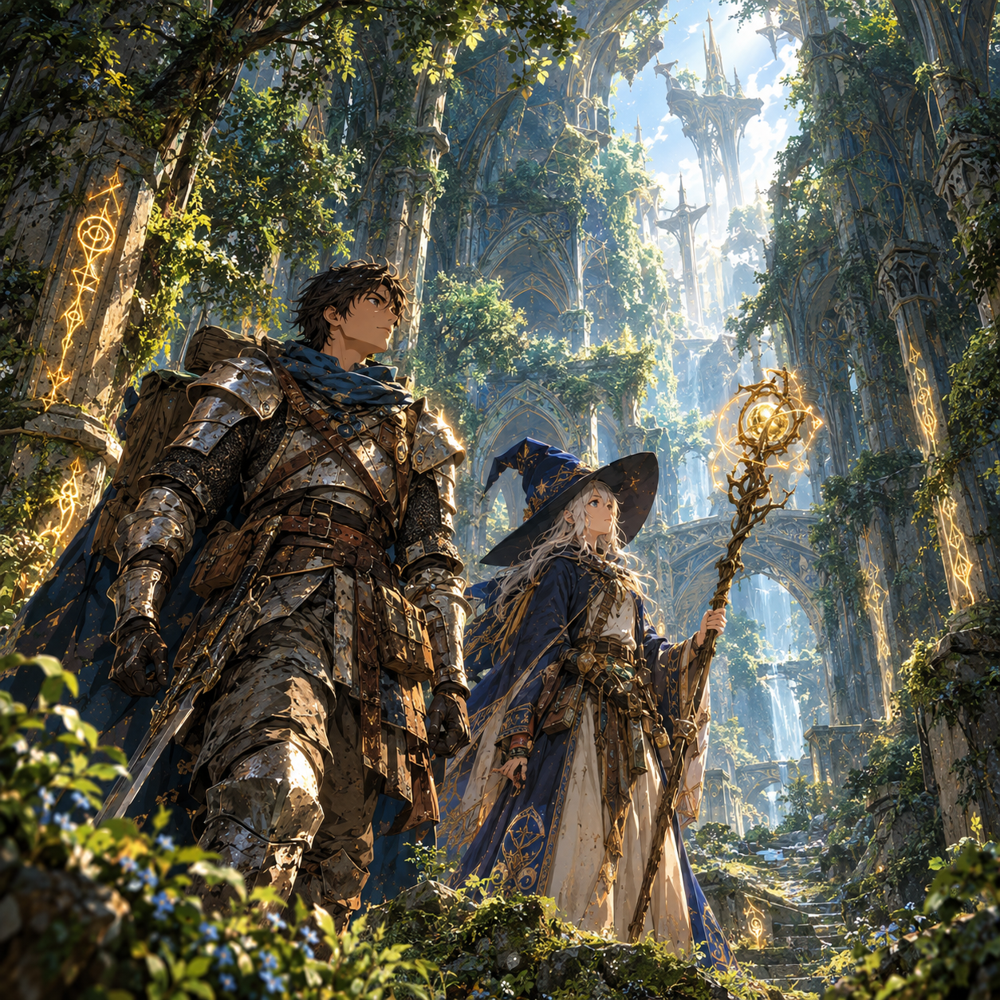

**G-07 · 剑与魔法（西幻）**（High Fantasy）

看点：看点：铠甲骑士与持杖法师并肩仰望巨树遗迹，符文金字与藤蔓共生，竖直构图把「古文明的高度」顶满画面——西幻组队经典机位。

<details><summary>📋 完整提示词（GPT 正文，复制即用）</summary>

```text
High fantasy anime illustration: an armored adventurer and a robed mage standing in the overgrown ruins of an elven hall. Build believable world detail, plate armor with real articulation and strap construction rather than drawn-on sculpting, a staff carved rather than manufactured, architecture following tall elvish proportion with weathered stone and forest slowly reclaiming the floor, and glowing runes acting as the only warm light source. Keep adventuring gear worn, repaired and mismatched. Compose a wide key visual with strong vertical columns and light dropping through a collapsed ceiling. No text, logos or watermarks.
```

</details>

</td>
</tr>
<tr>
<td valign="top" width="50%">

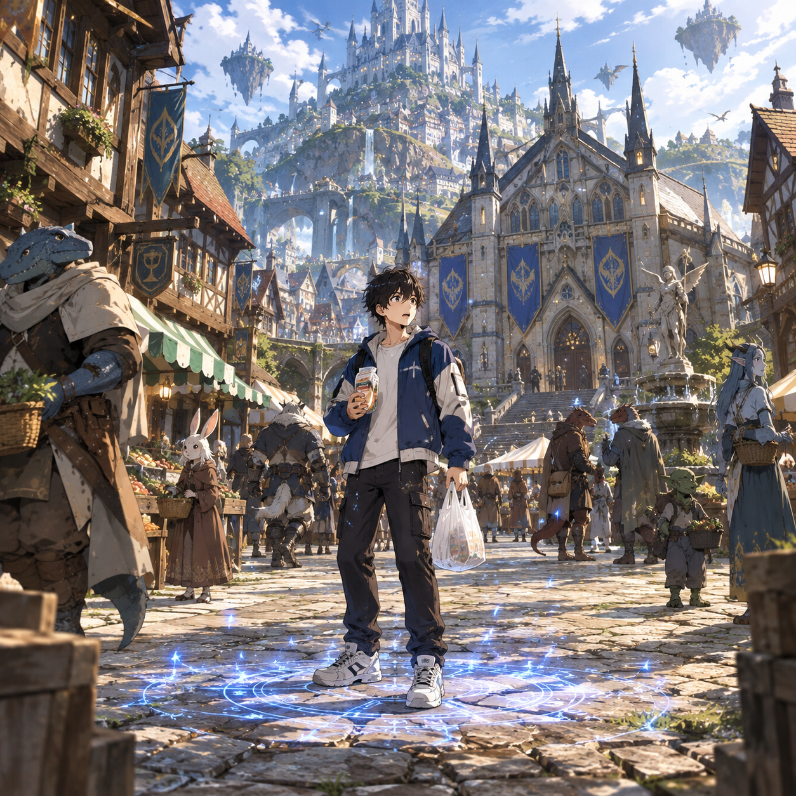

**G-08 · 异世界转生**（Isekai）

看点：看点：现代校服少年拎着塑料袋站在异世界集市，鞋下魔法阵微光，身后哥特教堂与浮空城——「穿越者刚落地」的错位感是异世界的核心叙事。

<details><summary>📋 完整提示词（GPT 正文，复制即用）</summary>

```text
Isekai anime illustration: a bewildered young man in modern clothing standing in a fantasy town square still clutching a convenience-store item. Stage the collision explicitly, contemporary sneakers, windbreaker and plastic bag set against hand-cobbled stone, heavy timber framing and a guildhall facade, with a summoning magic circle fading beneath his feet and its last blue embers lifting into the air. Populate the background with genuinely nonhuman townsfolk going about entirely ordinary business. Compose a wide frame in which the world visibly dwarfs him. Render signage without readable characters. No logos or watermarks.
```

</details>

</td>
<td valign="top" width="50%">

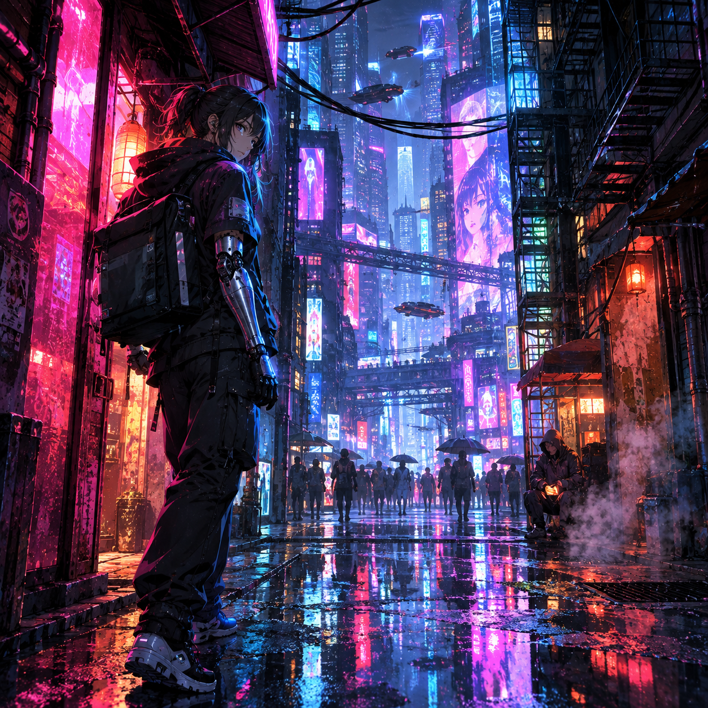

**G-13 · 赛博朋克**（Cyberpunk）

看点：看点：雨夜霓虹巷口的义体少女，粉紫青三色光源互相打架，积水倒影糊成一层电子光漆，远处飞车灯轨划过——赛博朋克的高密度都市要「发霉」才对。

<details><summary>📋 完整提示词（GPT 正文，复制即用）</summary>

```text
Cyberpunk anime illustration: a courier with a chrome prosthetic arm standing at the mouth of a rain-soaked alley in a stacked megacity. Build real density, signage layered six or seven storeys overhead, exposed cabling and bolted fire escapes, steam venting from street grates, and every wet surface mirroring the neon above it. Light her from competing magenta and cyan sources so both shoulders carry colored rim light while shadows sink toward black. Add broken reflections of unseen crowds in the puddles. Compose a deep wide frame with strong vertical recession. Render any signage without readable characters. No logos or watermarks.
```

</details>

</td>
</tr>
<tr>
<td valign="top" width="50%">

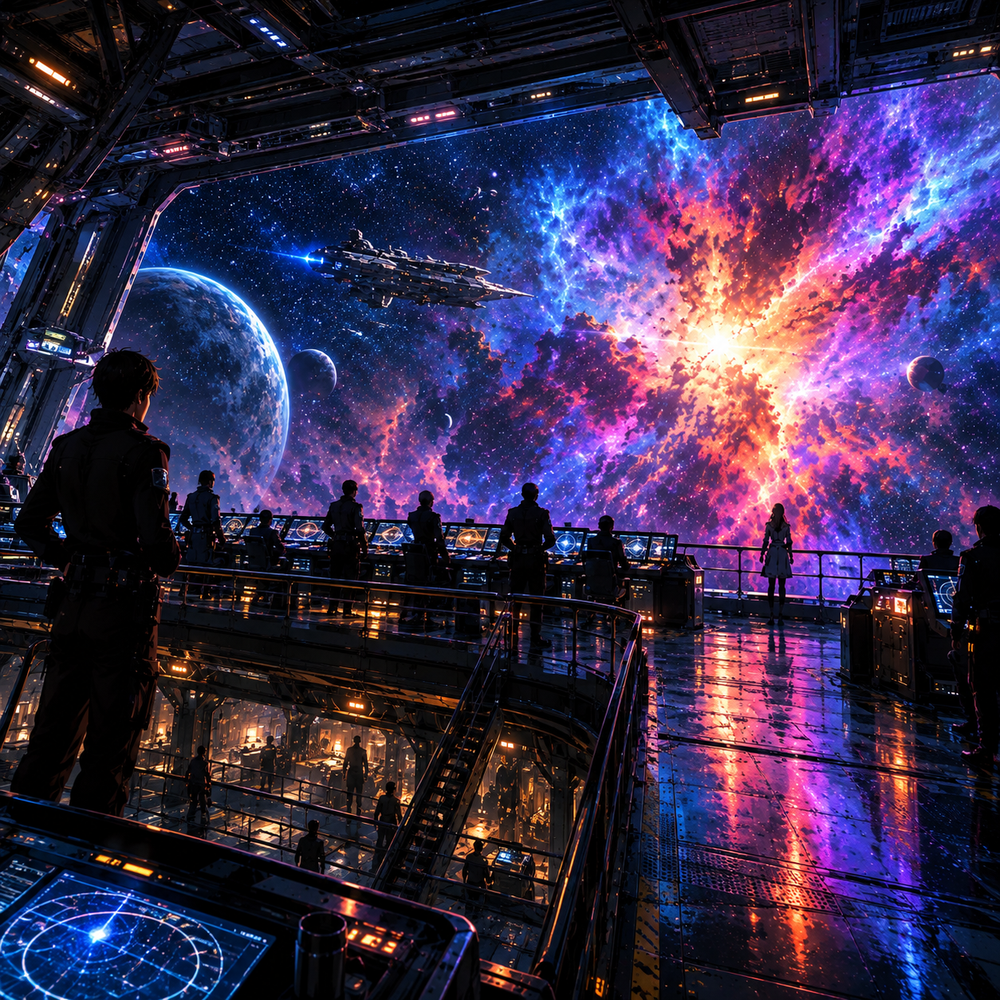

**G-15 · 宇宙歌剧 / 太空**（Space Opera）

看点：看点：舰桥剪影望向舷窗外的超新星星云，紫橙撞色的宇宙占满视口，仪表盘只给蓝光——宇宙歌剧的浪漫全在「人的渺小对星海的宏大」。

<details><summary>📋 完整提示词（GPT 正文，复制即用）</summary>

```text
Space opera anime illustration: a bridge crew silhouetted against a colored nebula from inside a starship command deck. Make the ship feel large and lived-in, a wide console run with believable instrumentation, heavy structural ribs overhead, layered deck levels and grime ground into the floor plating, set against a deep starfield and glowing gas cloud filling the forward viewport. Light the crew almost entirely from that window, keeping every face half in darkness. Leave one small figure standing apart at the rail for scale. Compose a wide atmospheric frame. Include no readable displays, logos or watermarks.
```

</details>

</td>
<td valign="top" width="50%">

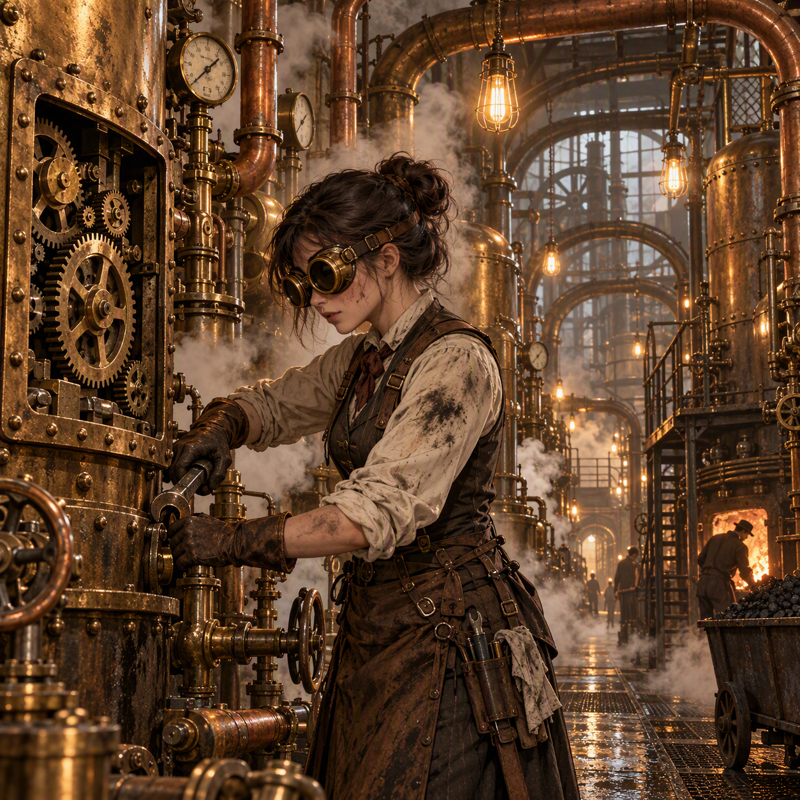

**G-17 · 蒸汽朋克**（Steampunk）

看点：看点：黄铜齿轮迷宫里的护目镜技师，蒸汽、油污、铆钉管道每一处都在运转，暖金色调把工业浪漫推到顶——蒸汽朋克的关键是机器要「活」。

<details><summary>📋 完整提示词（GPT 正文，复制即用）</summary>

```text
Steampunk anime illustration: an engineer in heavy goggles working inside a brass boiler room thick with steam. Commit to the material rules, machined brass gearing showing real tooth counts through open inspection plates, riveted pressure vessels, copper piping running in believable service routes rather than decoration, and Victorian tailoring cut for actual labor. Add honest grime, coal soot streaking every vertical surface and oil sheen on the floor plates. Use a warm sepia and verdigris scheme lit by hanging filament bulbs. Compose a mid-shot gaining depth through successive arches of pipework. No text, logos or watermarks.
```

</details>

</td>
</tr>
<tr>
<td valign="top" width="50%">

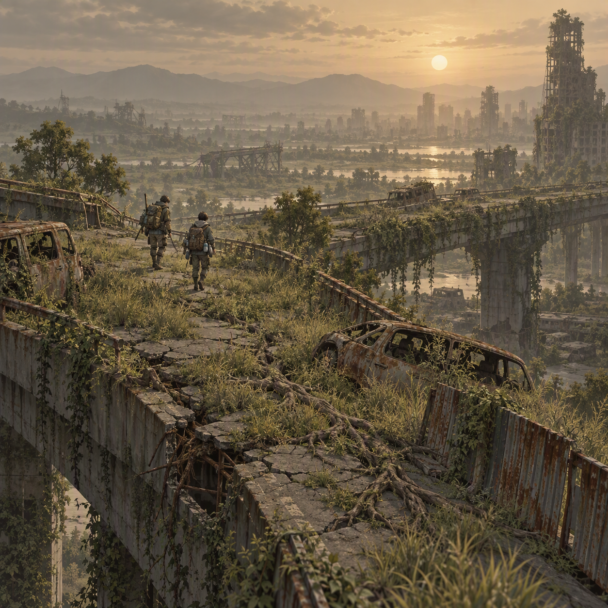

**G-18 · 末世 / 废土**（Post-Apocalyptic）

看点：看点：爬满绿藤的高速公路断桥上两个旅人走向夕阳，锈车与残楼被植被吞掉一半——废墟上长出自然，「希望的荒凉」比纯末日更耐看。

<details><summary>📋 完整提示词（GPT 正文，复制即用）</summary>

```text
Post-apocalyptic anime illustration: two scavengers crossing a rusted highway overpass slowly reclaimed by tall grass. Sell environmental recovery rather than ruin cliche, the road surface split apart by tree roots, vehicle hulks half buried in weeds, oxidized corrugated steel, and dust haze flattening the horizon into pale layers. Give them mismatched repaired survival clothing instead of costume, with improvised packs and improvised water filters. Desaturate everything toward ochre and grey-green, and let sunlight arrive low, thick and dusty. Compose a wide frame with the humans deliberately small in it. No text, logos or watermarks.
```

</details>

</td>
<td valign="top" width="50%">

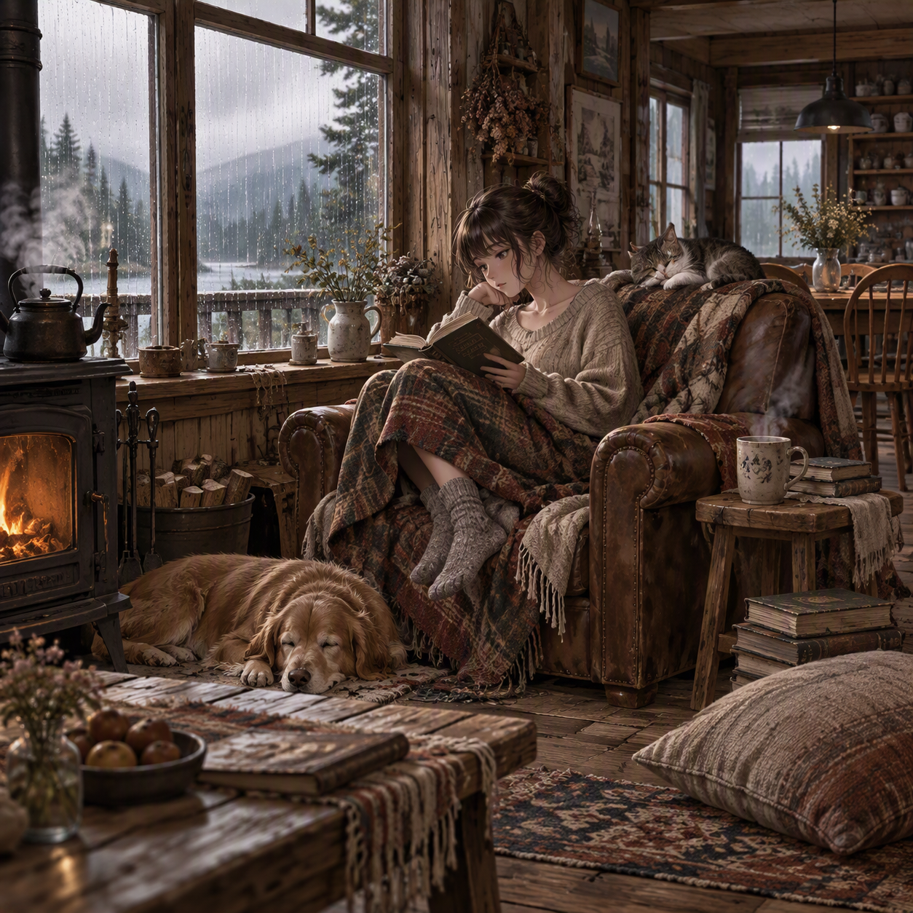

**G-21 · 治愈慢生活**（Healing Slice of Life）

看点：看点：壁炉、毛毯、猫狗与一本摊开的书，雨窗外是冷山湖，屋内暖光把每件织物烘出绒感——治愈系全靠「信息密度低加温度对比」。

<details><summary>📋 完整提示词（GPT 正文，复制即用）</summary>

```text
Healing slice-of-life anime illustration: a young woman reading in a wooden cabin living room while rain tracks down the window beside her. Build it from small comforts, worn furniture carrying visible use marks, steam lifting from a kettle and a mug caught in the light, layered blankets, and books stacked on the floor rather than shelved neatly. Let soft north daylight do all the work with no harsh contrast anywhere, and keep the palette warm and low-saturation. Compose a wide quiet interior with generous negative space and no urgency. No text, logos or watermarks.
```

</details>

</td>
</tr>
<tr>
<td valign="top" width="50%">

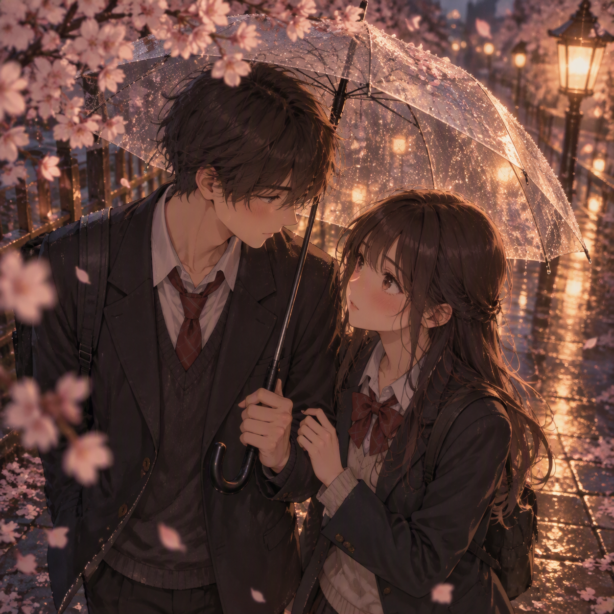

**G-22 · 恋爱 / 青春**（Romance）

看点：看点：共撑一把透明伞的两个校服学生，伞面挂着雨珠与樱花，路灯把轮廓描成金边——恋爱题材的「距离感」：近到能听见呼吸，又还没牵手。

<details><summary>📋 完整提示词（GPT 正文，复制即用）</summary>

```text
Romance anime illustration: two students sharing one umbrella beneath cherry blossom trees at dusk. Build the scene on restraint rather than declaration, eye contact only half completed, one hand hesitating near a sleeve, blossom petals catching the streetlight, and rain reduced to fine legible streaks so nothing obscures the pair. Render faces with soft gradients and genuine blush rather than graphic marks. Dissolve everything behind them into gentle bokeh so the two separate cleanly from the world. Compose a medium two-shot with slight overhead tilt. No text, logos or watermarks.
```

</details>

</td>
<td valign="top" width="50%">

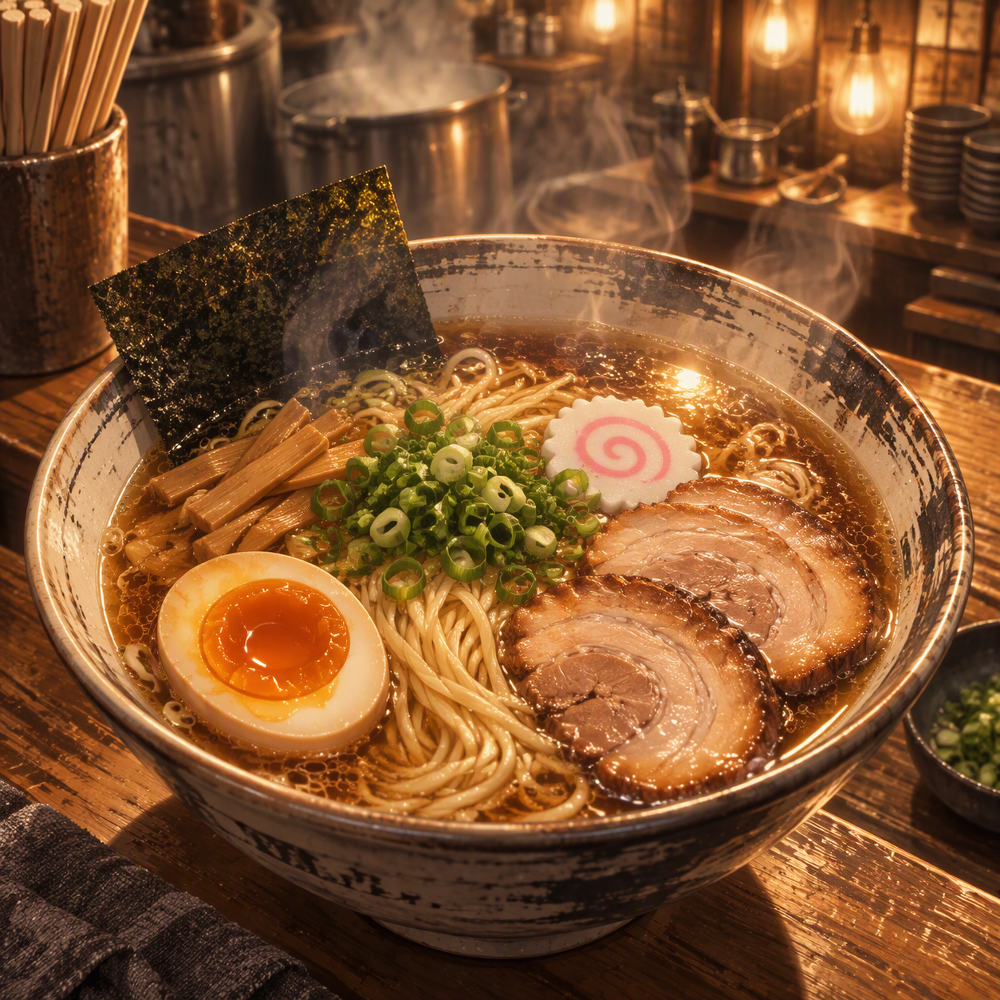

**G-23 · 美食 / 料理**（Food & Cooking）

看点：看点：拉面碗特写顶到画面边缘，溏心蛋断面、叉烧油花、海苔与蒸气的层次分明，暖灯下的汤面反光——美食题材第一定律：把食物当主角拍。

<details><summary>📋 完整提示词（GPT 正文，复制即用）</summary>

```text
Food-focused anime illustration: a bowl of ramen mid-preparation lit eagerly from a three-quarter overhead angle. Prioritize appetite over literal accuracy, glossy broth carrying a convincing specular highlight with floating beads of rendered oil, steam rising in soft readable plumes, noodles drawn with individual strand definition rather than a mass, nori and narutomaki placed deliberately, and chashu showing real grain and rendered fat marbling. Add warm practical kitchen bokeh with hanging bulbs behind. Compose a tight forward-overhead shot with the bowl dominating frame and no human figures. No text, logos or watermarks.
```

</details>

</td>
</tr>
<tr>
<td valign="top" width="50%">

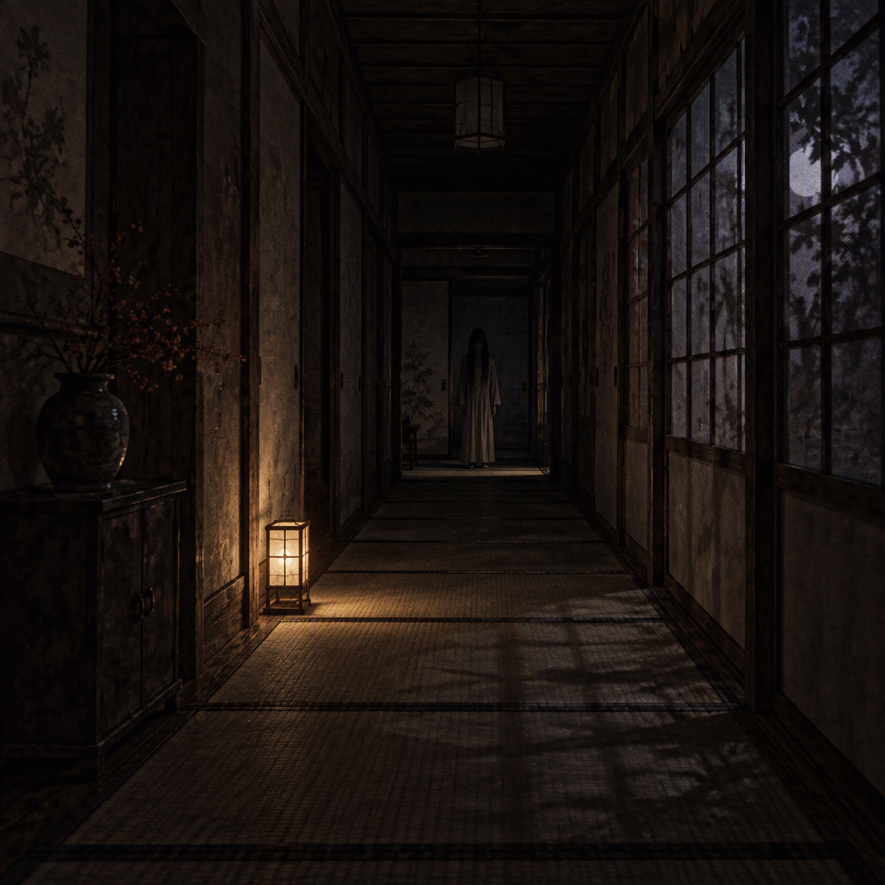

**G-30 · 恐怖 / 灵异**（Horror & Occult）

看点：看点：和馆长廊尽头立着一个白衣身影，全屋只点一盏行灯加窗外月光，画面九成压在暗部——恐怖感来自「不敢看清」，留白越多越慌。

<details><summary>📋 完整提示词（GPT 正文，复制即用）</summary>

```text
Horror anime illustration: a pale figure standing motionless at the far end of a dark tatami hallway at night. Keep the dread structural rather than graphic, negative space doing most of the work, shadows falling a few degrees wrong relative to the visible light source, subtle distortion in proportions the eye registers before the mind does, and grainy low-light texture concealing anything that would otherwise resolve. Use no gore, no blood and no jump-scare framing anywhere. Compose a deep one-point perspective with the figure small and unnaturally still. No text, logos or watermarks.
```

</details>

</td>
<td valign="top" width="50%">

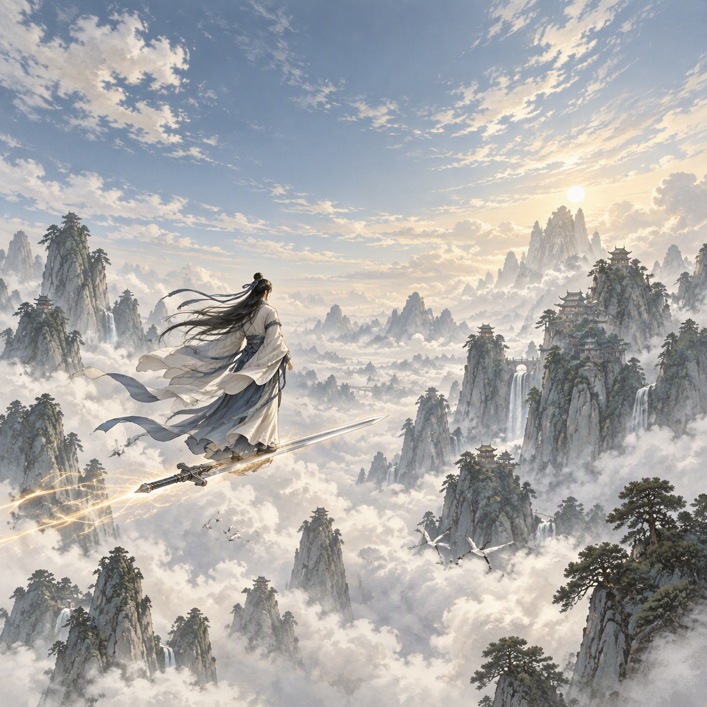

**G-32 · 仙侠 / 武侠国风**（Xianxia & Wuxia）

看点：看点：白衣修士踏剑掠过云海，山尖破云、飞瀑直下，金光从云隙里漏出——「御剑飞行加山水云海」的东方空间观，画面要能呼吸。

<details><summary>📋 完整提示词（GPT 正文，复制即用）</summary>

```text
Xianxia wuxia illustration: a cultivator riding a flying sword above a sea of cloud between jade mountain peaks. Hold to the regional vocabulary, layered hanfu with wide sleeves streaming in the altitude wind, the blade rendered fine and straight rather than as a fantasy broadsword, mountain forms drawn with vertical Chinese landscape logic instead of photographic geology, drifting mist handled as genuine negative space, and visible ink-wash influence throughout the far distance. Add a faint daoist talisman glow along the blade edge. Compose a vertical frame with enormous sky above. No text, logos or watermarks.
```

</details>

</td>
</tr>
</table>

<details><summary>📝 已登记提示词、待配图的条目（3 条）</summary>

| 条目 | 名称 | 验证点（配图时必须演示） |
| --- | --- | --- |
| A2-05 | 10 年代高清电视动画 | 线条极锐利、明度高，阴影分两层而不是一层——「看起来像新番」的制式感。 |
| A5-01 | 橡胶管动画（1930s） | 四肢像橡胶管任意弯曲不断、白手套、眯缝眼——程式化弯曲而轮廓不断线。 |
| A5-03 | 清晰线条派（丁丁线） | 人物线条粗细完全均匀、几乎无阴影，背景却极写实——人物简环境繁的反差是本流派签名。 |

</details>

<!-- GALLERY-EMBED:END -->

每一步都**能搜到风格**：中文名、别名、跨语言、描述式搜索都认。
每份结果都自带**效果说明**——四步各自决定什么、画风在你选的模型上叫不叫得动、
恒定保留什么（禁项）、哪些话没经过实测。说得清变化，而不是只甩一段英文。

本地使用：克隆后直接打开 `index.html`（与在线版同源）。
不克隆仓库、只想快速上手见 [`docs/quick-start.md`](docs/quick-start.md)；
在 Codex / WorkBuddy 等 Agent 里调用见 [`SKILL.md`](codex-skill/anime-prompt-forge/SKILL.md)；
不确定从哪开始，先看 [`INDEX.md`](INDEX.md) —— 一页索引，告诉你每个问题该查哪张表。

在此基础上还有一层**开放式知识库**：十二个库、**537 个节点**、九个组合槽位，外加检索 / 组合 / 变形三套引擎。它的目标是——

> **已知内容可检索，未收录内容可拆解，新的创作需求可通过模块组合与受控变形构建。**

也就是说：有的直接复制，没有的组合出来，组合之外还能再变形，生成空间不再受限于已收录的数据。

## ⚠️ 商用前必读：授权边界

**本库的代码、结构设计、以及 324 条 GPT 出图正文是原创的，可以商用。**
**但库里引用的作品名与在世创作者姓名不是你的，不能直接用于商业出图。**

这两件事必须分开看，混成一句「本库采用某许可」是最容易吃官司的一句话。

全库 935 项按四档标注（数字由 `assets/rights.js` 实时统计，不是估计值）：

| 档 | 名称 | 数量 | 商用 | 说明 |
|---|---|---|---|---|
| `R0` | 自由 | 674 | 可直接 | 通用技法与客观描述，不含任何他人标识 |
| `R1` | 署名 | 1 | 可，**需署名** | 已故创作者，风格已进公有领域 |
| `R2` | 仅参考 | 13 | 可，**先改写** | 在世创作者姓名、工作室名、品牌名 |
| `R3` | 禁止直接商用 | 247 | **需先改写** | 作品名称与角色设定，标题本身即标识 |

**R3 不是禁用，是「必须改写后使用」。** 个人学习与研究随便用（这正是保留 233 条作品条目的意义），但送进商业出图或对外交付前，必须改成纯视觉特征描述。

```
❌ gundam seed, angular armor, orange sunset
✅ hard surface, luminous eye visor, orthographic stance, angular armor, orange sunset
```

`RIGHTS.deIdentify()` 做的就是这件事——把标识换成视觉等价描述，不是弱化版。前者是标识，后者是真正能落到画面上的特征，模型认的是后者。

**再分发是另一回事**：R2/R3 条目不得随产品打包出售。库内可以研究，不能卖。

三档判定与改写质量由 `node tools/check_rights.js` 静态校验（38 项），改数据后请跑一遍。完整口径见《动漫提示词库》第 11.5 节。

## 目录结构

```
anime-prompt-library/
├── index.html              可检索网页（双击打开，离线可用）
├── INDEX.md                一页索引：我想干的事 → 该查哪张表
├── AGENTS.md               Agent 在本库上工作的硬规矩
├── 动漫提示词库.md          Markdown 源文件（自动生成，二次编辑友好）
├── build_md.js             从数据源生成 Markdown
├── examples/               示例画廊的图（按旧 id 命名）
├── assets/                 ★ 唯一数据源，改这里
│   ├── prompt-kit.js          提示词卡派生引擎（画质分档 + 标签/负面词派生）
│   ├── data-core.js            第一层：画风流派 45 条（技法/年代/工作室/地区）
│   ├── data-core-more.js       第一层：全球流派 14 条 ★ 见下方说明
│   ├── data-works-jp.js        第二层：日本动画作品 85 条
│   ├── data-works-global.js    第二层：国产 + 欧美 + 游戏 IP 53 条
│   ├── data-works-more-a.js    第二层：日本补遗 27 + 韩国 6 + 印度东南亚 5
│   ├── data-works-eur-w.js     第二层：欧洲西部 23 条（法比/英爱/北欧）
│   ├── data-works-eur-e.js     第二层：苏联东欧 10 + 德西 2 + 拉美 5
│   ├── data-works-namer.js     第二层：北美 17 条（源流/国民卡通/成人动画）
│   ├── data-genres.js          第三层：题材元素 32 + 横切词条库 14 组
│   ├── data-layout.js          第四层：排版图型 30 条（社媒卡/信息图/分镜/IP/电商/封面）
│   ├── data-palette.js         第五层：主题配色 12 条（主色 + 点缀色）
│   ├── data-misc.js            模板 16 + 负面词 8 + 平台语法 8
│   ├── data-prompts-*.js       15 个文件 · 324 条英文 GPT 出图正文 ★ 见下方说明
│   ├── data-prompts-zh-*.js    5 个文件 · 91 条中文正文（画风 + 题材）
│   │
│   ├── schema.js            开放式知识库的元模型（十二库 / 九槽位 / 评级 / 证据 / 规则）
│   ├── lib-form.js          库 01·02·03 领域形式 / 全球文化 / 作品实体
│   ├── lib-visual.js        库 04 视觉风格（上）造型 · 比例 · 面部 · 线条 · 上色
│   ├── lib-visual2.js       库 04 视觉风格（下）材质 · 空间 · 光影 · 色彩 · 完成度 · 时间质感
│   ├── lib-creature.js      库 05 角色与生物（上）身份 · 体格 · 年龄 · 毛发 · 表情
│   ├── lib-creature2.js     库 05 角色与生物（中）服装 · 体态 · 非人角色
│   ├── lib-creature3.js     库 05 角色与生物（下）生物怪物 · 机械仿生
│   ├── lib-world.js         库 06 世界与资产（上）地形 · 气候 · 时间 · 建筑
│   ├── lib-world2.js        库 06 世界与资产（下）室内 · 道具 · 载具 · 世界观尺度
│   ├── lib-story.js         库 07 故事与表演
│   ├── lib-lens.js          库 08 镜头与时空
│   ├── lib-voice.js         库 09 声音与语言
│   ├── lib-prod.js          库 10 生产与交付
│   ├── lib-morph.js         库 11 组合与变形
│   ├── lib-retrieve.js      库 12 检索与验证
│   ├── engine.js            引擎：retrieve / compose / morph
│   ├── codes.js              编码规则唯一真源：旧 id → 规范 code（纯函数）
│   ├── rights.js             授权分级唯一真源：四档 / 标识表 / 去标识化 / 商用判定
│   ├── code-map.js           编码迁移表：旧码永久可解析（只增不删）
│   ├── resolver.js           六类输入解析：编码 / 旧编码 / 旧 ID / 中文名 / 英文名 / 别名
│   ├── registry.js           全库登记：935 项进码表与解析器
│   ├── prompts-zh.js         中文正文统一查表（旧 ID 与规范码双向可查）
│   ├── studio.js             出图工作流核心：四步选择 → 拼装正文 / 标签 / 负面词
│   ├── render.js             出图通道：模型 / 比例 / 自定义尺寸 / 请求构造
│   ├── render-net.js         请求执行层：单张与抽卡共用（含退避重试）★
│   ├── model-prompts.js      按模型改写提示词：同一组四步，五个模型五份词★
│   ├── gacha.js              抽卡池：槽位从工作流派生、规模现算、可扩展★
│   ├── studio-ui.js          网页端「出图工作流」视图 + 出图面板 + 模型卡
│   ├── gacha-ui.js           网页端「一键抽卡」独立视图
│   ├── code-ui.js            网页端「编码工作台」与「编码总览」两个视图
│   └── open-ui.js            网页端另外四个知识库视图（画廊 / 检索 / 组合 / 变形）
└── tools/
    ├── _loadlist.js          测试脚本清单的唯一真源（★ 见下方说明）
    ├── check_text.py         字符污染扫描（非 ASCII / 非中日文）
    ├── detect_latin.py       中文字段混拉丁词扫描（比 check_text 更严）
    ├── check_prompts.js      提示词卡体检（覆盖率 / 重复 / 非 ASCII / 字数）
    ├── check_studio.js       出图工作流体检（四栏候选 / 中英正文 / 缺步诊断 / 授权 / 出图通道）★
    ├── inventory.js          提示词覆盖度盘点，导出 tools/_missing.json
    ├── repair_text.py        按显式映射修复污染词条
    ├── check_han.py          繁体 / 日式汉字泄漏扫描（简繁同形字已排除）
    ├── check_engine.js       知识库引擎冒烟（十二库 / 检索 / 组合 / 变形 / 冲突）
    ├── check_codes.js        编码体系验证（唯一 / 长度 / 无漏编 / 五类输入 / 组合串）
    ├── check_ids.js          编号漂移体检（WK 冻结名单 / 追加稳定 / 四写法 / 三源互证 / 全库引用扫描）★
    ├── check_rights.js        授权契约验证：分级落库 / 误报 / 正文IP 扫描 / 去标识化 / 中文正文
    ├── ui_test.js            真实 DOM 测试（jsdom）：侧栏逐点 + 出图工作流 + 遮挡回归 ★
    ├── tier_audit.js         画质档位分布盘点（分板块 / 反向抽查）
    ├── shot_studio.js        用无头 Chrome 截出出图工作流那一屏，人工核对
    └── smoke.js              网页运行时冒烟测试（含提示词卡覆盖率 + 知识库视图）
```
